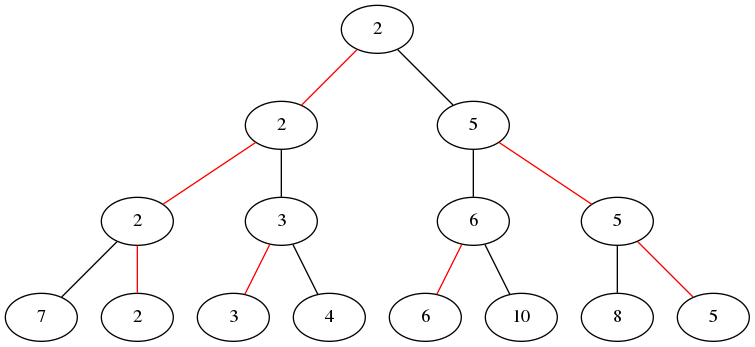

锦标赛排序又被称为树形选择排序，是 [选择排序](/selection-sort.md) 的优化版本，在选择排序中用 $O(n)$ 的时间来选取一个元素，而锦标赛排序用 $O(\log n)$ 的时间选取一个元素，其总时间复杂度是 $O(n\log n)$ ，需要 $O(n)$ 的辅助空间。锦标赛排序是堆排序的一种变体。

锦标赛排序算法的名字来源于一种单败淘汰制的竞赛形式，在单败淘汰制中有许多选手参与比赛，两两比较胜出的选手进入下一轮比赛。这种淘汰方式能够决定最好的选手，但是在最后一轮比赛中被淘汰的选手不一定是第二好的，他可能不如先前被淘汰的选手。

## 算法流程



如图所示，这是一棵 **最小锦标赛排序树** ，待排序数据是叶子节点显示的数据。红色边显示的是每一轮比较中较小的数据的胜出路径。显然完成一次＂锦标赛＂可以选出一组数据中最小的那一个。

每一轮对 $n$ 个数据进行比较并且得到 $\frac{n}{2}$ 个＂优胜者＂，每一对中较小的数据进入下一轮比较。如果无法凑齐一对，数据那么这个数据直接进入下一轮的比较。


完成一次＂锦标赛＂后需要将被选出的那个数据去除，不妨直接将其设置为 $\infty$ ，这个操作类似我们熟悉的 [堆排序](/heap-sort.md) ，然后我们就可以再进行一次＂锦标赛＂选出次小的那个数据了。一直重复这个这个操作，直至所有数据有序。

## 代码实现

```cpp
int n, a[maxn], tmp[maxn << 1];

int winner(int pos1, int pos2) {
  int u = pos1 >= n ? pos1 : tmp[pos1];
  int v = pos2 >= n ? pos2 : tmp[pos2];
  if (tmp[u] <= tmp[v]) return u;
  return v;
}

void creat_tree(int &value) {
  for (int i = 0; i < n; i++) tmp[n + i] = a[i];
  for (int i = 2 * n - 1; i > 1; i -= 2) {
    int j, k = i / 2;
    if (i % 2 == 0 && i < 2 * n - 1)
      j = i + 1;
    else if (i > 1)
      j = i - 1;
    tmp[k] = winner(i, j);
  }
  value = tmp[tmp[1]];
  tmp[tmp[1]] = INF;
}

void recreat(int &value) {
  int i = tmp[1];
  while (i > 1) {
    int j, k = i / 2;
    if (i % 2 == 0 && i < 2 * n - 1)
      j = i + 1;
    else if (i > 1)
      j = i - 1;
    tmp[k] = winner(i, j);
    i = k;
  }
  value = tmp[tmp[1]];
  tmp[tmp[1]] = INF;
}

void tournament_sort() {
  int value;
  creat_tree(value);
  for (int i = 0; i < n; i++) {
    a[i] = value;
    recreat(value);
  }
}
```
