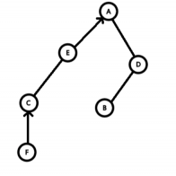
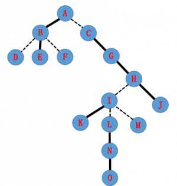
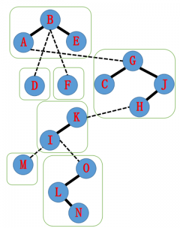
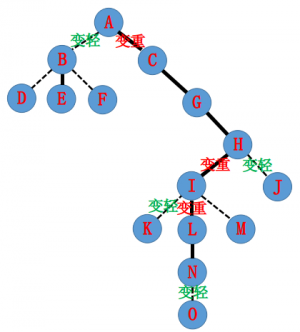
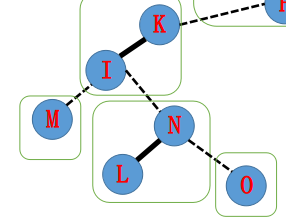
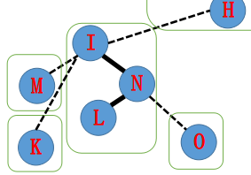

## 简介

1.  Link/Cut Tree 是一种数据结构，我们用它来解决<font color="red">动态树问题</font>
2.  Link/Cut Tree 又称 Link-Cut Tree，简称 LCT, 但它不叫动态树，动态树是指一类问题。
3.  Splay Tree 是 LCT 的基础，但是 LCT ⽤的 Splay Tree 和普通的 Splay 在细节处不太一样。
4.  这是⼀个和 Splay ⼀样只需要写⼏ (yi) 个 (dui) 核心函数就能实现一切的数据结构。

## 问题引入

-   维护一棵树，支持如下操作。
-   修改两点间路径权值。
-   查询两点间路径权值和。
-   修改某点子树权值。
-   查询某点子树权值和。
      唔，看上去是一道树剖模版题。

那么我们加两个操作

-   断开并连接一些边，保证仍是一棵树。
-   在线求出上面的答案。

——动态树问题的解决方法：Link/Cut Tree!

## 动态树问题

-   维护一个<font color="red">森林</font>, 支持删除某条边，加⼊某条边，并保证加边，删边之后仍是森林。我们要维护这个森林的一些信息。

-   一般的操作有两点连通性，两点路径权值和，连接两点和切断某条边、修改信息等。

* * *

### 从 LCT 的角度回顾一下树链剖分

-   对整棵树按子树⼤小进⾏剖分，并重新标号。

-   我们发现重新标号之后，在树上形成了一些以链为单位的连续区间，并且可以用线段树进⾏区间操作。

### 转向动态树问题

-   我们发现我们刚刚讲的树剖是以子树⼤小作为划分条件。

-   那我们能不能重定义一种剖分，使它更适应我们的动态树问题呢？

-   考虑动态树问题需要什么链。

-   由于动态维护⼀个森林，显然我们希望这个链是我们指定的链，以便利⽤来求解。

## <font color = "red">实链剖分</font>

-   对于⼀个点连向它所有⼉子的边 , 我们⾃己选择⼀条边进行剖分，我们称被选择的边为实边，其他边则为虚边。

-   对于实边，我们称它所连接的⼉子为实⼉子。

-   对于⼀条由实边组成的链，我们同样称之为实链。

-   请记住我们选择实链剖分的最重要的原因：它是我们选择的，灵活且可变。

-   正是它的这种灵活可变性，我们采用 Splay Tree 来维护这些实链。

## LCT！

-   我们可以简单的把 LCT 理解成用⼀些 Splay 来维护动态的树链剖分，以期实现动态树上的区间操作。

-   对于每条实链，我们建⼀个 Splay 来维护整个链区间的信息。

-   接下来，我们来学习 LCT 的具体结构。

## - 辅助树

-   我们刚才在说的建树方法，其实就是辅助树的建树方法，我们先来 看⼀看辅助树的一些性质，再通过一张图实际了解一下辅助树的具体结构。

1.  每⼀个 Splay 维护的是一条路径，并且在原树中所有节点深度严格递增，并且，中序遍历这棵 Splay 得到的点序列列的点深度严格递增。
2.  每个节点包含且仅包含于一棵 Splay 中。
3.  ⼀棵 Splay 的根节点的 Father 指向它在辅助树中的父亲结点。但是它父亲结点的 ch 并没有指向这个点的。即父亲不不⼀定认⼉子，⽽⼉子能找到⽗亲。
4.  由于 LCT 的 Access 操作（后面会解释），使得 3. 中的⽗亲不认⼉子对答案⽆任何影响，同时，也使一些叶⼦结点单独构成一棵 Splay 辅助树成为可能
5.  由于辅助树的以上性质，我们维护任何操作都不不需要维护原树，辅助树可以在任何情况下拿出一个唯一的原树，我们只需要维护辅助树即可。（本句来源自 大爷 @PoPoQQQ 的 PPT)

在本文里，你可以认为一些 Splay 构成了一个辅助树，每棵辅助树维护的是一棵树，一些辅助树构成了 LCT，其维护的是整个森林。

-   现在我们有⼀棵原树，如图。
-   加粗边是实边，虚线边是虚边


-   由刚刚的定义，辅助树的结构如下



### 考虑原树和辅助树的结构关系

-   原树中的实链 : 在辅助树中节点都在一棵 Splay 中

-   原树中的虚链 : 在辅助树中，子节点所在 Splay 的 Father 指向父节点，但是父节点的两个儿子都不指向子节点。

-   注意：原树的根不等于辅助树的根。

-   原树的 Father 指向不等于辅助树的 Father 指向。

-   辅助树是可以在满足辅助树、Splay 的性质下任意换根的。

-   虚实链变换可以轻松在辅助树上完成，这也就是实现了动态维护树链剖分。

### 接下来要用到的变量声明

-    `ch[N][2]` 左右⼉子

-    `f[N]` ⽗亲指向

-    `sum[N]` 路径权值和

-    `val[N]` 点权

-    `tag[N]` 翻转标记

-    `laz[N]` 权值标记

-    `siz[N]` 辅助树上子树大小

-   Other_Vars

### 函数声明

#### ⼀般数据结构函数（字面意思）

1.  PushUp(x)
2.  PushDown(x)

#### Splay 系函数（不会多做解释）

1.  Get(x) 获取 x 是父亲的哪个⼉子。
2.  Splay(x) 通过和 Rotate 操作联动实现把 x 旋转到<font color = "red">当前 Splay 的根。</font>
3.  Rotate(x) 将 x 向上旋转一层的操作。

#### 新操作

1.  IsRoot(x) 判断当前节点是否是所在 Splay 的根。
2.  Access(x) 把从根到当前节点的所有点放在⼀条实链里，使根到它成为一条实路径，并且在同一棵 Splay 里。
3.  Update(x) 在 Access 操作之后，递归地从上到下 Pushdown 更新信息。
4.  MakeRoot(x) 使 x 点成为整棵辅助树的根。
5.  Link(x, y) 在 x, y 两点间连⼀一条边。
6.  Cut(x, y) 把 x, y 两点间边删掉。
7.  Find(x) 找到 x 所在的 Splay 的根节点编号。
8.  Fix(x, v) 修改 x 的点权为 v。
9.  Split(x, y) 提取出 x, y 间的路径，方便做区间操作。

### 宏定义

-    `#define ls ch[p][0]` 
-    `#define rs ch[p][1]` 

## 函数讲解

先从简单的来吧

###  `PushUp()` 

```cpp
inline void PushUp(int p) {
  // maintain other variables
  siz[p] = siz[ls] + siz[rs];
}
```

###  `PushDown()` 

```cpp
inline void PushDown(int p) {
  if (tag[p] != std_tag) {
    // pushdown the tag
    tag[p] = std_tag;
  }
}
```

###  `Splay() && Rotate()` 

有些不一样了哦

```cpp
#define Get(x) (ch[f[x]][1] == x)
inline void Rotate(int x) {
  int y = f[x], z = f[y], k = Get(x);
  if (!isRoot(y)) ch[z][ch[z][1] == y] = x;
  // 上面这句一定要写在前面，普通的Splay是不用的，因为 isRoot  (后面会讲)
  ch[y][k] = ch[x][!k], f[ch[y][k]] = y;
  ch[x][!k] = y, f[y] = x, f[x] = z;
  PushUp(x), PushUp(y);
}
inline void Splay(int x) {
  Update(
      x);  // 马上就能看到啦。 在 Splay之前要把旋转会经过的路径上的点都PushDown
  for (int fa; fa = f[x], !isRoot(x); Rotate(x)) {
    if (!isRoot(fa)) Rotate(Get(fa) == Get(x) ? fa : x);
  }
}
```

如果上面的几个函数你看不懂，请移步[Splay](/ds/splay/)

下面要开始 LCT 独有的函数了哦

###  `isRoot()` 

```cpp
// 在前面我们已经说过，LCT 具有 如果一个儿子不是实儿子，他的父亲找不到它的性质
// 所以当一个点既不是它父亲的左儿子，又不是它父亲的右儿子，它就是当前 Splay 的根
#define isRoot(x) (ch[f[x]][0] != x && ch[f[x]][1] != x)
```

### <code><font color = "red">Access()</font></code>

```cpp
// Access 是 LCT
// 的核心操作，试想我们像求解一条路径，而这条路径恰好就是我们当前的一棵 Splay，
// 直接调用其信息即可。先来看一下代码，再结合图来看看过程
inline void Access(int x) {
  for (int p = 0; x; p = x, x = f[x]) {
    Splay(x), ch[x][1] = p, PushUp(x);
  }
}
```

我们有这样一棵树，实线为实边，虚线为虚边



-   它的辅助树可能长成这样（构图方式不同可能 LCT 的结构也不同）
-   每个绿框里是一棵 Splay。



-   现在我们要 Access(N), 把 A 到 N 路径上的边都变为实边，拉成一棵 Splay



-   实现的方法是从下到上逐步更新 Splay
-   首先我们要把 N 旋至当前 Splay 的根。
-   为了保证 AuxTree（辅助树）的性质，原来 N 到 O 的实边要更改为虚边。
-   由于认父不认子的性质，我们可以单方面的把 N 的儿子改为 Null。
-   于是原来的 AuxTree 就从下图变成了下下图。





-   下一步，我们把 N 指向的 Father-> I 也旋转到它 (I) 的 Splay 树根。

-   原来的实边 I—K 要去掉，这时候我们把 I 的右儿子指向 N, 就得到了 I—L 这样一棵 Splay。


-   接下来，按照刚刚的操作步骤，由于 I 的 Father 指向 H, 我们把 H 旋转到他所在 Splay Tree 的根，然后把 H 的 rs 设为 I。

-   之后的树是这样的。


-   同理我们 Splay(A) , 并把 A 的右儿子指向 H。
-   于是我们得到了这样一棵 AuxTree。并且发现 A——N 的整个路径已经在同一棵 Splay 中了。大功告成！


```cpp
// 回顾一下代码
inline void Access(int x) {
  for (int p = 0; x; p = x, x = f[x]) {
    Splay(x), ch[x][1] = p, PushUp(x);
  }
}
```

我们发现 Access() 其实很容易。只有如下四步操作：

1.  把当前节点转到根。
2.  把儿子换成之前的节点。
3.  更新当前点的信息。
4.  把当前点换成当前点的父亲，继续操作。

###  `Update()` 

```cpp
// 从上到下一层一层 pushDown 即可
void Update(int p) {
  if (!isRoot(p)) Update(f[p]);
  pushDown(p);
}
```

###  `makeRoot()` 

-   Make_Root() 的重要性丝毫不亚于 Access()。我们在需要维护路径信息的时候，一定会出现路径深度无法严格递增的情况，根据 AuxTree 的性质，这种路径是不能出现在一棵 Splay 中的。
-   这时候我们需要用到 Make_Root()。
-   Make_Root() 的作用是使指定的点成为原树的根，考虑如何实现这种操作。
-   我们发现 Access(x) 后，x 在 Splay 中一定是深度最大的点（从根到 x, 深度严格递增）。
-   而变成根即是变成深度最小的点。我们 Splay(x) , 发现这时候 x 并没有右子树（即所有点深度都比它浅）。那我们把 x 的左右儿子交换一下，变成了 x 没有左子树，在 AuxTree 意义上就是深度最小的点了，即达到目的。
-   所以我们交换左右儿子，并给右儿子打一个翻转标记即可。（此时左儿子没有值）。

```cpp
inline void makeRoot(int p) {
  Access(p), Splay(p);
  swap(ls, rs);
  tag[p] ^= 1;
}
```

###  `Link()` 

-   Link 两个点其实很简单，先 Make_Root(x) , 然后把 x 的父亲指向 y 即可。显然，这个操作肯定不能发生在同一棵树内，所以记得先判一下。

```cpp
inline void Link(int x, int p) {
  makeRoot(x);
  f[x] = p;
}
```

###  `Split()` 

-   Split 操作意义很简单，就是拿出一棵 Splay , 维护的是 x 到 y 的路径。
-   先 MakeRoot(x)，然后 Access(y)。如果要 y 做根，再 Splay(y)。
-   就这三句话，没写代码，需要的时候可以直接打这三个就好辣！
-   另外 Split 这三个操作直接可以把需要的路径拿出到 y 的子树上，那不是随便干嘛咯。

###  `Cut()` 

-   Cut 有两种情况，保证合法和不一定保证合法。（废话）
-   如果保证合法，直接 split(x, y)，这时候 y 是根，x 一定是它的儿子，双向断开即可。就像这样：

```cpp
inline void Cut(int x, int p) {
  makeRoot(x), Access(p), Splay(p), ls = f[x] = 0;
}
```

如果是不保证合法，我们需要判断一下是否有，我选择使用 map 存一下，但是这里有一个利用性质的方法：

想要删边，必须要满足如下三个条件：

1.  x, y 连通。
2.  x, y 的路径上没有其他的链。
3.  x 没有右儿子。
4.  总结一下，上面三句话的意思就一个：x, y 之间有边。

具体实现就留作一个思考题给大家。判断连通需要用到后面的 Find , 其他两点稍作思考分析一下结构就知道该怎么判断了。

###  `Find()` 

-   Find() 其实就是找到当前辅助树的根。在 Access(p) 后，再 splay(p)。这样根就是树里最小的那个，一直往 ls 走，沿途 PushDown 即可。
-   一直走到没有 ls, 非常简单。

```cpp
inline int Find(int p) {
  Access(p), Splay(p);
  while (ls) pushDown(p), p = ls;
  return p;
}
```

### 一些提醒

-   干点啥前一定要想一想需不需要 PushUp 或者 PushDown, LCT 由于特别灵活的原因，少 Pushdown 或者 Pushup 一次就可能把修改改到不该改的点上！
-   LCT 的 rotate 和 splay 的不太一样， `if (z)` 一定要放在前面。
-   LCT 的 splay 就是旋转到根，没有旋转到谁儿子的操作，因为不需要。

## 一些题

-   [「SDOI2008」Cave 洞穴勘测](https://lydsy.com/JudgeOnline/problem.php?id=2049)
-   [「BZOJ 3282」Tree](https://lydsy.com/JudgeOnline/problem.php?id=3282)
-   [「HNOI2010」Bounce 弹飞绵羊](https://lydsy.com/JudgeOnline/problem.php?id=2002)
-   [「BZOJ 2631」tree](https://lydsy.com/JudgeOnline/problem.php?id=2631)
