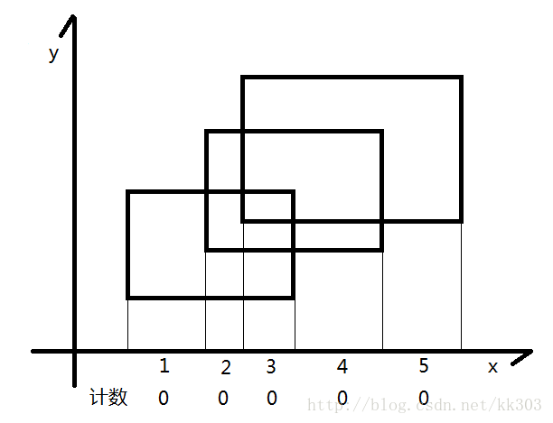
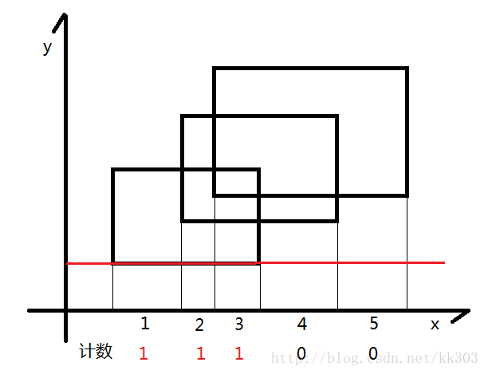
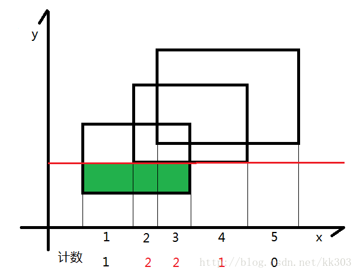
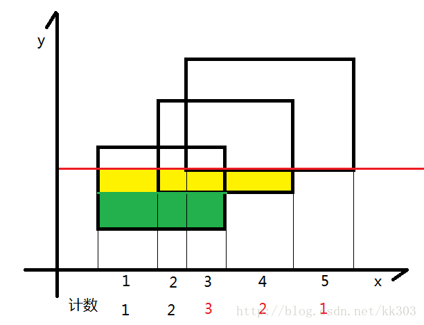
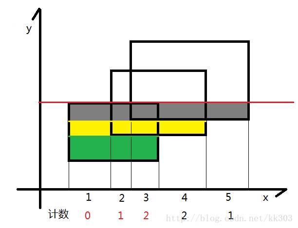
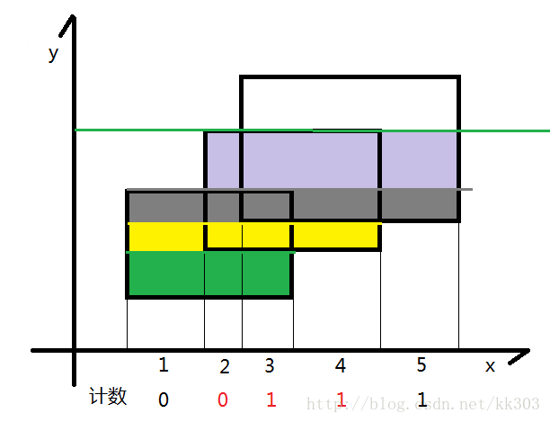
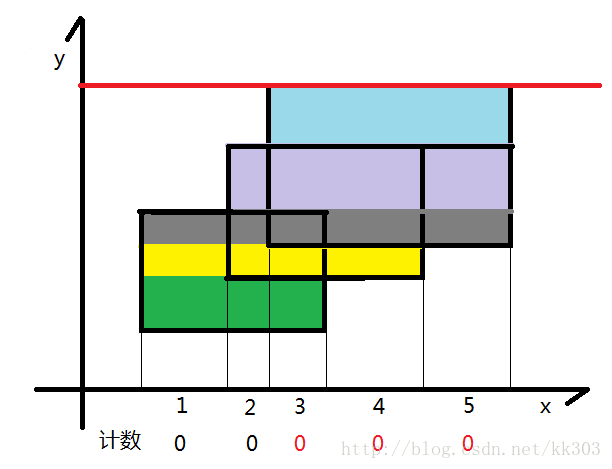

## 简介

我们如何在计算机程序中存储几何图形呢？比如多边形？最容易想到的方法就是保存多边形的顶点坐标。只要按顺序保存了多边形各个顶点的坐标，这个多边形就唯一确定了。另一方面，显示器是如何显示几何图形的呢？显示设备通常提供一个帧缓冲存储器（俗称显存），可以把它当做二维数组，该数组存储的值与屏幕上显示的每一像素的颜色一一对应。那么问题来了，如何把程序中的几何图形转换成显存中的几何图形？这就是扫描线算法的用途。

总结下来：扫描线算法把几何图形在计算机中的顶点表示法转换成点阵表示法。需要注意的是转换成点阵表示法后其实是对多边形进行了填充，而不是只有轮廓。

## 基本思想

由于多边形千变万化，要想填充多边形内部的所有像素，需要找到一种合适的规则，能够沿着一个方向，一个像素不漏地把多边形内部填满，同时不污染多边形外部。于是我们发明了一条水平方向的扫描线，它从y=0开始，判断与多边形的交点，这些交点把扫描线分成了若干段，我们需要判断哪些段在多边形内部，哪些段在多边形外部，然后把内部的部分着色，完成后，令y=y+1，即扫描线上移一格，重复之前的操作，直到扫描线不再与多边形的任何部分相交。

举例说明，下图所示为多边形 $P_1P_2P_3P_4P_5P_6$，而且同时画出了扫描线扫描过程中经过的四个位置 $y=1$、$y=2$、$y=6$ 和 $y=7$。
 


扫描线算法的难点在于如何判断扫描线被多边形分割后哪些部分在多边形内部，哪些部分在多边形外部。

让我们仔细观察上图，答案就在图中。对于未经过顶点的扫描线，如 $y=6$，总是与多边形有偶数个交点，而且位于多边形内部的片段和位于多边形外部的片段交替存在。对于经过了顶点的扫描线，如 $y=1$、$y=2$ 和 $y=7$，与多边形的交点既可能是偶数，也可能是奇数。但是如果我们进一步划分，这些经过了顶点的扫描线有些经过了极值顶点，如$y=1$和$y=7$，它们的交点个数是奇数；而有些经过了非极值顶点，如 $y=2$，它们的交点个数是偶数。这样的话，不如做一个特殊处理，把所有极值顶点当成两个点，就可以保证扫描线与多边形的交点总是偶数。

当然，把交点个数凑成偶数是有意义的，凑成偶数后就可以把这些交点从左到右两两配对，配对成功的两个点之间的像素全部着色。例如，上图的扫描线 $y=6$ 与多边形的交点序列是 $ABCD$，从左到右两两配对为 $AB$ 和 $CD$，然后将 $AB$ 之间着色，$CD$ 之间着色。

基本思想就是这样，其实很容易理解。不过用代码实现起来并不那么容易，需要考虑很多细节。

## Atlantis 问题

### 题意

在二维坐标系上，给出多个矩形的左下以及右上坐标，求出所有矩形构成的图形的面积。

### 解法

根据图片可知总面积可以直接暴力即可求出面积，如果数据大了怎么办？这时就需要讲到 **扫描线** 算法。

### 流程

现在假设我们有一根线，从下往上开始扫描：















- 如图所示，我们可以把整个矩形分成如图各个颜色不同的小矩形，那么这个小矩形的高就是我们扫过的距离，那么剩下了一个变量，那就是矩形的长一直在变化。
- 我们的线段树就是为了维护矩形的长，我们给每一个矩形的上下边进行标记，下面的边标记为 1，上面的边标记为 -1，每遇到一个矩形时，我们知道了标记为 1 的边，我们就加进来这一条矩形的长，等到扫描到 -1 时，证明这一条边需要删除，就删去，利用 1 和 -1 可以轻松的到这种状态。
- 还要注意这里的线段树指的并不是线段的一个端点，而指的是一个区间，所以我们要计算的是 $r+1$ 和 $r-1$ 。
- 需要 [离散化](../misc/discrete.md) 。

???+note "代码实现"
    ```cpp
    #include <algorithm>
    #include <cstdio>
    #include <cstring>
    #define maxn 300
    using namespace std;
    
    int lazy[maxn << 3];  // 标记了这条线段出现的次数
    double s[maxn << 3];
    
    struct node1 {
      double l, r;
      double sum;
    } cl[maxn << 3];  // 线段树
    
    struct node2 {
      double x, y1, y2;
      int flag;
    } p[maxn << 3];  // 坐标
    
    //定义sort比较
    bool cmp(node2 a, node2 b) { return a.x < b.x; }
    
    //上传
    void pushup(int rt) {
      if (lazy[rt] > 0)
        cl[rt].sum = cl[rt].r - cl[rt].l;
      else
        cl[rt].sum = cl[rt * 2].sum + cl[rt * 2 + 1].sum;
    }
    
    //建树
    void build(int rt, int l, int r) {
      if (r - l > 1) {
        cl[rt].l = s[l];
        cl[rt].r = s[r];
        build(rt * 2, l, (l + r) / 2);
        build(rt * 2 + 1, (l + r) / 2, r);
        pushup(rt);
      } else {
        cl[rt].l = s[l];
        cl[rt].r = s[r];
        cl[rt].sum = 0;
      }
      return;
    }
    
    //更新
    void update(int rt, double y1, double y2, int flag) {
      if (cl[rt].l == y1 && cl[rt].r == y2) {
        lazy[rt] += flag;
        pushup(rt);
        return;
      } else {
        if (cl[rt * 2].r > y1) update(rt * 2, y1, min(cl[rt * 2].r, y2), flag);
        if (cl[rt * 2 + 1].l < y2)
          update(rt * 2 + 1, max(cl[rt * 2 + 1].l, y1), y2, flag);
        pushup(rt);
      }
    }
    
    int main() {
      int temp = 1, n;
      double x1, y1, x2, y2, ans;
      while (scanf("%d", &n) && n) {
        ans = 0;
        for (int i = 0; i < n; i++) {
          scanf("%lf %lf %lf %lf", &x1, &y1, &x2, &y2);
          p[i].x = x1;
          p[i].y1 = y1;
          p[i].y2 = y2;
          p[i].flag = 1;
          p[i + n].x = x2;
          p[i + n].y1 = y1;
          p[i + n].y2 = y2;
          p[i + n].flag = -1;
          s[i + 1] = y1;
          s[i + n + 1] = y2;
        }
        sort(s + 1, s + (2 * n + 1));  // 离散化
        sort(p, p + 2 * n, cmp);  // 把矩形的边的纵坐标从小到大排序
        build(1, 1, 2 * n);       // 建树
        memset(lazy, 0, sizeof(lazy));
        update(1, p[0].y1, p[0].y2, p[0].flag);
        for (int i = 1; i < 2 * n; i++) {
          ans += (p[i].x - p[i - 1].x) * cl[1].sum;
          update(1, p[i].y1, p[i].y2, p[i].flag);
        }
        printf("Test case #%d\nTotal explored area: %.2lf\n\n", temp++, ans);
      }
      return 0;
    }
    ```

## 练习

-  [「HDU1542」Atlantis](http://acm.hdu.edu.cn/showproblem.php?pid=1542) 

-  [「HDU1828」Picture](http://acm.hdu.edu.cn/showproblem.php?pid=1828) 

-  [「HDU3265」Posters](http://acm.hdu.edu.cn/showproblem.php?pid=3265) 

## 参考资料

-  <https://www.jianshu.com/p/d9be99077c2b>

-  <https://www.cnblogs.com/yangsongyi/p/8378629.html> 

-  <https://blog.csdn.net/riba2534/article/details/76851233> 

-  <https://blog.csdn.net/winddreams/article/details/38495093>
