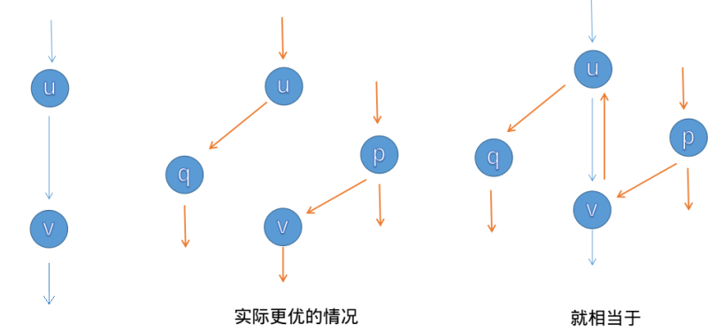

## 定义

我们有一张图，要求从源点流向汇点的最大流量（可以有很多条路到达汇点），就是我们的最大流问题。

求解最大流问题有三种常见算法：Edmonds-Karp 算法，Dinic 算法，ISAP 算法。

## 增广路

求解最大流之前，我们先认识以下增广路的概念。

**增广路**指的是，从源点到汇点，只要有 $flow$ ( $flow>0$ ) 流过去，这条路就是增广路。在一些最大流算法中，就是将这些路**增广**（意思就是走掉这条路，带走的流量肯定就是这条路的最小流量），如图：


我们从 $4$ 到 $3$ ，肯定可以先从流量为 $20$ 的这条边先走。那么这条边就被走掉了，不能再选，总的流量为 $20$ （现在）。然后我们可以这样选择：

1.   $4\rightarrow2\rightarrow3$ 这条**增广路**的总流量为 $20$ 。到 $2$ 的时候还是 $30$ ，到 $3$ 了就只有 $20$ 了。

2.   $4\rightarrow2\rightarrow1\rightarrow3$ 这样子我们就很好的保留了 $30$ 的流量。

所以我们这张图的最大流就应该是 $20+30=50$ 。

求最大流是很简单的，接下来讲解求最大流的 $3$ 种方法。

### Edmond-Karp 动能算法（ $EK$ 算法）

这个算法很简单，就是 BFS**找增广路**，然后对其进行**增广**。你可能会问，怎么找？怎么增广？

1.  找？我们就从源点一直 BFS 走来走去，碰到汇点就停，然后增广（每一条路都要增广）。我们在 BFS 的时候就注意一下流量合不合法就可以了。

2.  增广？其实就是按照我们找的增广路在重新走一遍。走的时候把这条路的能够成的最大流量减一减，然后给答案加上最小流量就可以了。

再讲一下**反向边**。增广的时候要注意建造反向边，原因是这条路不一定是最优的，这样子程序可以进行反悔。假如我们对这条路进行增广了，那么其中的每一条边的反向边的流量就是它的流量。



讲一下一些小细节。如果你是用邻接矩阵的话，反向边直接就是从 $table[x,y]$ 变成 $table[y,x]$ 。如果是常用的链式前向星，那么在加入边的时候就要先加入反向边。那么在用的时候呢，我们直接 $i\operatorname{xor}1$ 就可以了 ( $i$ 为边的编号）。为什么呢？相信大家都是知道 $\operatorname{xor}$ 的，那么我们在加入正向边后加入反向边，就是靠近的，所以可以使用 $\operatorname{xor}$ 。我们还要注意一开始的编号要设置为 $tot=1$ ，因为边要从编号 $2$ 开始，这样子 $\operatorname{xor}$ 对编号 $2,3$ 的边才有效果。

EK 算法的时间复杂度为 $O(n^2m)$ （其中 $n$ 为点数， $m$ 为边数）。效率还有很大提升空间。

```cpp
#include <algorithm>
#include <cstdio>
#include <cstring>
#include <queue>
#define INF 0x3f3f3f3f
using namespace std;
struct edge {
  int v, w, next;
} e[200005];
struct node {
  int v, e;
} p[10005];
int head[10005], vis[10005];
int n, m, s, t, cnt = 1;
void addedge(int u, int v, int w) {
  e[++cnt].v = v;
  e[cnt].w = w;
  e[cnt].next = head[u];
  head[u] = cnt;
}
bool bfs() {
  queue<int> q;
  memset(p, 0, sizeof(p));
  memset(vis, 0, sizeof(vis));
  vis[s] = 1;
  q.push(s);
  while (!q.empty()) {
    int cur = q.front();
    q.pop();
    for (int i = head[cur]; i; i = e[i].next)
      if ((!vis[e[i].v]) && e[i].w) {
        p[e[i].v].v = cur;
        p[e[i].v].e = i;
        if (e[i].v == t) return 1;
        vis[e[i].v] = 1;
        q.push(e[i].v);
      }
  }
  return 0;
}
int main() {
  scanf("%d%d%d%d", &n, &m, &s, &t);
  for (int i = 1; i <= m; i++) {
    int u, v, w;
    scanf("%d%d%d", &u, &v, &w);
    addedge(u, v, w);
    addedge(v, u, 0);
  }
  int ans = 0;
  while (bfs()) {
    int minw = INF;
    for (int i = t; i != s; i = p[i].v) minw = min(minw, e[p[i].e].w);
    for (int i = t; i != s; i = p[i].v) {
      e[p[i].e].w -= minw;
      e[p[i].e ^ 1].w += minw;
    }
    ans += minw;
  }
  printf("%d\n", ans);
  return 0;
}
```

### Dinic

**Dinic 算法**的过程是这样的：每次增广前，我们先用 BFS 来将图分层。设源点的层数为 0，那么一个点的层数便是它离源点的最近距离。

通过分层，我们可以干两件事情：

1.  如果不存在到汇点的增广路（即汇点的层数不存在），我们即可停止增广。
2.  确保我们找到的增广路是最短的。（原因见下文）

接下来是 DFS 找增广路的过程。

我们每次找增广路的时候，都只找比当前点层数多 1 的点进行增广（这样就可以确保我们找到的增广路是最短的）。

Dinic 算法有两个优化：

1.  **多路增广**：每次找到一条增广路的时候，如果残余流量没有用完怎么办呢？我们可以利用残余部分流量，再找出一条增广路。这样就可以在一次 DFS 中找出多条增广路，大大提高了算法的效率。
2.  **当前弧优化**：如果一条边已经被增广过，那么它就没有可能被增广第二次。那么，我们下一次进行增广的时候，就可以不必再走那些已经被增广过的边。

设点数为 $n$ ，边数为 $m$ ，那么 Dinic 算法的时间复杂度是 $O(nm^2)$ ，在稀疏图上效率和 EK 算法相当，但在稠密图上效率要比 EK 算法高很多。

特别地，在求解二分图最大匹配问题时，可以证明 Dinic 算法的时间复杂度是 $O(n \sqrt{m})$ 。

```cpp
#include <algorithm>
#include <cstdio>
#include <cstring>
#include <queue>
#define INF 0x3f3f3f3f
using namespace std;
struct edge {
  int v, w, next;
} e[200005];
int n, m, s, t, cnt = 1;
int head[100005], dep[100005], vis[100005], cur[100005];
void addedge(int u, int v, int w) {
  e[++cnt].v = v;
  e[cnt].w = w;
  e[cnt].next = head[u];
  head[u] = cnt;
}
bool bfs() {
  queue<int> q;
  memset(dep, INF, sizeof(dep));
  memset(vis, 0, sizeof(vis));
  memcpy(cur, head, sizeof(head));
  dep[s] = 0;
  vis[s] = 1;
  q.push(s);
  while (!q.empty()) {
    int p = q.front();
    q.pop();
    vis[p] = 0;
    for (int i = head[p]; i; i = e[i].next)
      if (dep[e[i].v] > dep[p] + 1 && e[i].w) {
        dep[e[i].v] = dep[p] + 1;
        if (!vis[e[i].v]) {
          vis[e[i].v] = 1;
          q.push(e[i].v);
        }
      }
  }
  if (dep[t] == INF) return 0;
  return 1;
}
int dfs(int p, int w) {
  if (p == t) return w;
  int used = 0;                           //已经使用的流量
  for (int i = cur[p]; i; i = e[i].next)  //每条边都尝试找一次增广路
  {
    cur[p] = i;  //当前弧优化
    if (dep[e[i].v] == dep[p] + 1 && e[i].w) {
      int flow = dfs(e[i].v, min(w - used, e[i].w));
      if (flow) {
        used += flow;
        e[i].w -= flow;
        e[i ^ 1].w += flow;
        if (used == w) break;  //残余流量用尽了就停止增广
      }
    }
  }
  return used;
}
int main() {
  scanf("%d%d%d%d", &n, &m, &s, &t);
  for (int i = 1; i <= m; i++) {
    int u, v, w;
    scanf("%d%d%d", &u, &v, &w);
    addedge(u, v, w);
    addedge(v, u, 0);
  }
  int ans = 0;
  while (bfs()) ans += dfs(s, INF);
  printf("%d\n", ans);
  return 0;
}
```

### ISAP

这个是 SAP 算法的加强版 (Improved)。
