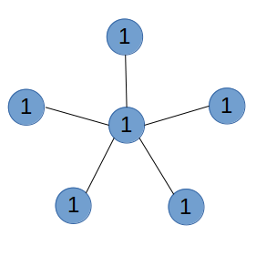
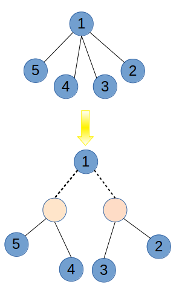

## 点分治

点分治适合处理大规模的树上路径信息问题。

??? note " 例题[luogu P3806【模板】点分治 1](https://www.luogu.org/problemnew/show/P3806)"

    给定一棵有 $n$ 个点的带点权树，$m$ 次询问，每次询问给出 $k$ ，询问树上距离为 $k$ 的点对是否存在。

    $n\le 10000,m\le 100,k\le 10000000$

我们先随意选择一个结点作为根结点 $rt$ ，所有完全位于其子树中的路径可以分为两种，一种是经过当前根结点的路径，一种是不经过当前根结点的路径。对于经过当前根结点的路径，又可以分为两种，一种是以根结点为一个端点的路径，另一种是两个端点都不为根结点的路径。而后者又可以由两条属于前者链合并得到。所以，对于枚举的根结点 $rt$ ，我们先计算在其子树中且经过该结点的路径对答案的贡献，再递归其子树对不经过该结点的路径进行求解。

在本题中，对于经过根结点 $rt$ 的路径，我们先枚举其所有子结点 $ch$ ，以 $ch$ 为根计算 $ch$ 子树中所有结点到 $rt$ 的距离。记结点 $i$ 到当前根结点 $rt$ 的距离为 $dist_i$ ， $tf_{d}$ 表示之前处理过的子树中是否存在一个结点 $v$ 使得 $dist_v=d$ 。若一个询问的 $k$ 满足 $tf_{k-dist_i}=true$ ，则存在一条长度为 $k$ 的路径。在计算完 $ch$ 子树中所连的边能否成为答案后，我们将这些新的距离加入 $tf$ 数组中。

注意在清空 $tf$ 数组的时候不能直接用 `memset` ，而应将之前占用过的 $tf$ 位置加入一个队列中，进行清空，这样才能保证时间复杂度。

点分治过程中，每一层的所有递归过程合计对每个点处理一次，假设共递归 $h$ 层，则总时间复杂度为 $O(h\times n)$ 。

若我们 **每次选择子树的重心作为根结点** ，可以保证递归层数最少，时间复杂度为 $O(n\log_2 n)$ 。

请注意在重新选择根结点之后一定要重新计算子树的大小，否则一点看似微小的改动就可能会使时间复杂度错误或正确性难以保证。

代码：

```cpp
#include <algorithm>
#include <cstdio>
#include <cstring>
#include <queue>
using namespace std;
const int maxn = 20010;
const int inf = 2e9;
int n, m, a, b, c, q[maxn], rt, siz[maxn], maxx[maxn], dist[maxn];
int cur, h[maxn], nxt[maxn], p[maxn], w[maxn];
bool tf[10000010], ret[maxn], vis[maxn];
void add_edge(int x, int y, int z) {
  cur++;
  nxt[cur] = h[x];
  h[x] = cur;
  p[cur] = y;
  w[cur] = z;
}
int sum;
void calcsiz(int x, int fa) {
  siz[x] = 1;
  maxx[x] = 0;
  for (int j = h[x]; j; j = nxt[j])
    if (p[j] != fa && !vis[p[j]]) {
      calcsiz(p[j], x);
      maxx[x] = max(maxx[x], siz[p[j]]);
      siz[x] += siz[p[j]];
    }
  maxx[x] = max(maxx[x], sum - siz[x]);
  if (maxx[x] < maxx[rt]) rt = x;
}
int dd[maxn], cnt;
void calcdist(int x, int fa) {
  dd[++cnt] = dist[x];
  for (int j = h[x]; j; j = nxt[j])
    if (p[j] != fa && !vis[p[j]])
      dist[p[j]] = dist[x] + w[j], calcdist(p[j], x);
}
queue<int> tag;
void dfz(int x, int fa) {
  tf[0] = true;
  tag.push(0);
  vis[x] = true;
  for (int j = h[x]; j; j = nxt[j])
    if (p[j] != fa && !vis[p[j]]) {
      dist[p[j]] = w[j];
      calcdist(p[j], x);
      for (int k = 1; k <= cnt; k++)
        for (int i = 1; i <= m; i++)
          if (q[i] >= dd[k]) ret[i] |= tf[q[i] - dd[k]];
      for (int k = 1; k <= cnt; k++) tag.push(dd[k]), tf[dd[k]] = true;
      cnt = 0;
    }
  while (!tag.empty()) tf[tag.front()] = false, tag.pop();
  for (int j = h[x]; j; j = nxt[j])
    if (p[j] != fa && !vis[p[j]]) {
      sum = siz[p[j]];
      rt = 0;
      maxx[rt] = inf;
      calcsiz(p[j], x);
      calcsiz(rt, -1);
      dfz(rt, x);
    }
}
int main() {
  scanf("%d%d", &n, &m);
  for (int i = 1; i < n; i++)
    scanf("%d%d%d", &a, &b, &c), add_edge(a, b, c), add_edge(b, a, c);
  for (int i = 1; i <= m; i++) scanf("%d", q + i);
  rt = 0;
  maxx[rt] = inf;
  sum = n;
  calcsiz(1, -1);
  calcsiz(rt, -1);
  dfz(rt, -1);
  for (int i = 1; i <= m; i++)
    if (ret[i])
      printf("AYE\n");
    else
      printf("NAY\n");
  return 0;
}
```

??? note " 例题[luogu  P4178 Tree](https://www.luogu.org/problemnew/show/P4178)"

    给定一棵有 $n$ 个点的带权树，给出 $k$ ，询问树上距离为 $k$ 的点对数量。

    $n\le 40000,k\le 20000,w_i\le 1000$

由于这里查询的是树上距离为 $[0,k]$ 的点对数量，所以我们用线段树来支持维护和查询。

```cpp
#include <algorithm>
#include <cstdio>
#include <cstring>
#include <queue>
#define int long long
using namespace std;
const int maxn = 2000010;
const int inf = 2e9;
int n, a, b, c, q, rt, siz[maxn], maxx[maxn], dist[maxn];
int cur, h[maxn], nxt[maxn], p[maxn], w[maxn], ret;
bool vis[maxn];
void add_edge(int x, int y, int z) {
  cur++;
  nxt[cur] = h[x];
  h[x] = cur;
  p[cur] = y;
  w[cur] = z;
}
int sum;
void calcsiz(int x, int fa) {
  siz[x] = 1;
  maxx[x] = 0;
  for (int j = h[x]; j; j = nxt[j])
    if (p[j] != fa && !vis[p[j]]) {
      calcsiz(p[j], x);
      maxx[x] = max(maxx[x], siz[p[j]]);
      siz[x] += siz[p[j]];
    }
  maxx[x] = max(maxx[x], sum - siz[x]);
  if (maxx[x] < maxx[rt]) rt = x;
}
int dd[maxn], cnt;
void calcdist(int x, int fa) {
  dd[++cnt] = dist[x];
  for (int j = h[x]; j; j = nxt[j])
    if (p[j] != fa && !vis[p[j]])
      dist[p[j]] = dist[x] + w[j], calcdist(p[j], x);
}
queue<int> tag;
struct segtree {
  int cnt, rt, lc[maxn], rc[maxn], sum[maxn];
  void clear() {
    while (!tag.empty()) update(rt, 1, 20000000, tag.front(), -1), tag.pop();
    cnt = 0;
  }
  void print(int o, int l, int r) {
    if (!o || !sum[o]) return;
    if (l == r) {
      printf("%lld %lld\n", l, sum[o]);
      return;
    }
    int mid = (l + r) >> 1;
    print(lc[o], l, mid);
    print(rc[o], mid + 1, r);
  }
  void update(int& o, int l, int r, int x, int v) {
    if (!o) o = ++cnt;
    if (l == r) {
      sum[o] += v;
      if (!sum[o]) o = 0;
      return;
    }
    int mid = (l + r) >> 1;
    if (x <= mid)
      update(lc[o], l, mid, x, v);
    else
      update(rc[o], mid + 1, r, x, v);
    sum[o] = sum[lc[o]] + sum[rc[o]];
    if (!sum[o]) o = 0;
  }
  int query(int o, int l, int r, int ql, int qr) {
    if (!o) return 0;
    if (r < ql || l > qr) return 0;
    if (ql <= l && r <= qr) return sum[o];
    int mid = (l + r) >> 1;
    return query(lc[o], l, mid, ql, qr) + query(rc[o], mid + 1, r, ql, qr);
  }
} st;
void dfz(int x, int fa) {
  // tf[0]=true;tag.push(0);
  st.update(st.rt, 1, 20000000, 1, 1);
  tag.push(1);
  vis[x] = true;
  for (int j = h[x]; j; j = nxt[j])
    if (p[j] != fa && !vis[p[j]]) {
      dist[p[j]] = w[j];
      calcdist(p[j], x);
      for (int k = 1; k <= cnt; k++)
        if (q - dd[k] >= 0)
          ret += st.query(st.rt, 1, 20000000, max(0ll, 1 - dd[k]) + 1,
                          max(0ll, q - dd[k]) + 1);
      for (int k = 1; k <= cnt; k++)
        st.update(st.rt, 1, 20000000, dd[k] + 1, 1), tag.push(dd[k] + 1);
      cnt = 0;
    }
  st.clear();
  for (int j = h[x]; j; j = nxt[j])
    if (p[j] != fa && !vis[p[j]]) {
      sum = siz[p[j]];
      rt = 0;
      maxx[rt] = inf;
      calcsiz(p[j], x);
      calcsiz(rt, -1);
      dfz(rt, x);
    }
}
int main() {
  scanf("%lld", &n);
  for (int i = 1; i < n; i++)
    scanf("%lld%lld%lld", &a, &b, &c), add_edge(a, b, c), add_edge(b, a, c);
  scanf("%lld", &q);
  rt = 0;
  maxx[rt] = inf;
  sum = n;
  calcsiz(1, -1);
  calcsiz(rt, -1);
  dfz(rt, -1);
  printf("%lld\n", ret);
  return 0;
}
```

## 边分治

与上面的点分治类似，我们选取一条边，把树尽量均匀地分成两部分（使边连接的两个子树的 $size$ 尽量接近）。然后递归处理左右子树，统计信息。

ちょっとまって，这不行吧……

考虑一个菊花图



我们发现当一个点下有多个 $size$ 接近的儿子时，复杂度变得不对起来。

那，乖乖点分治好了（bushi

我们想如果这个图是个二叉树，那么就完美了。~~（所以，我们只对二叉树使用边分治~~

所以我们考虑如何把一个多叉树转化成二叉树。

显然，我们只需像线段树那样建树就可以了。就像这样



新建出来的点根据题目要求给予恰当的信息即可。例如：统计路径长度时，将原边边权赋为 $1$ , 将新建的边边权赋为 $0$ 即可。

分析复杂度，发现最多会增加 $O(n)$ 个点，则总复杂度为 $O(n\log n)$ 

几乎所有点分治的题边分都能做（常数上有差距，但是不卡），所以就不放例题了。

## 点分树

点分树是通过更改原树形态使树的层数变为稳定 $\log n$ 的一种重构树。

常用于解决与树原形态无关的带修改问题。

### 算法分析

我们通过点分治每次找重心的方式来对原树进行重构。

将每次找到的重心与上一层的重心缔结父子关系，这样就可以形成一棵 $\log n$ 层的树。

由于树是 $\log n$ 层的，很多原来并不对劲的暴力在点分树上均有正确的复杂度。

### 代码实现

有一个小 trick：每次用递归上一层的总大小 $tot$ 减去上一层的点的重儿子大小，得到的就是这一层的总大小。这样求重心就只需一次 dfs 了

```cpp
#include <bits/stdc++.h>

using namespace std;

typedef vector<int>::iterator IT;

struct Edge {
  int to, nxt, val;

  Edge() {}
  Edge(int to, int nxt, int val) : to(to), nxt(nxt), val(val) {}
} e[300010];
int head[150010], cnt;

void addedge(int u, int v, int val) {
  e[++cnt] = Edge(v, head[u], val);
  head[u] = cnt;
}

int siz[150010], son[150010];
bool vis[150010];

int tot, lasttot;
int maxp, root;

void getG(int now, int fa) {
  siz[now] = 1;
  son[now] = 0;
  for (int i = head[now]; i; i = e[i].nxt) {
    int vs = e[i].to;
    if (vs == fa || vis[vs]) continue;
    getG(vs, now);
    siz[now] += siz[vs];
    son[now] = max(son[now], siz[vs]);
  }
  son[now] = max(son[now], tot - siz[now]);
  if (son[now] < maxp) {
    maxp = son[now];
    root = now;
  }
}

struct Node {
  int fa;
  vector<int> anc;
  vector<int> child;
} nd[150010];

int build(int now, int ntot) {
  tot = ntot;
  maxp = 0x7f7f7f7f;
  getG(now, 0);
  int g = root;
  vis[g] = 1;
  for (int i = head[g]; i; i = e[i].nxt) {
    int vs = e[i].to;
    if (vis[vs]) continue;
    int tmp = build(vs, ntot - son[vs]);
    nd[tmp].fa = now;
    nd[now].child.push_back(tmp);
  }
  return g;
}

int virtroot;

int main() {
  int n;
  cin >> n;
  for (int i = 1; i < n; i++) {
    int u, v, val;
    cin >> u >> v >> val;
    addedge(u, v, val);
    addedge(v, u, val);
  }
  virtroot = build(1, n);
}
```
