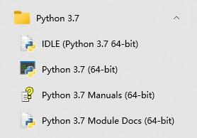

## 关于 Python

Python 是一种目前已在世界上广泛使用的解释型面向对象语言，非常适合用来测试算法片段和原型，也可以用来刷一些 OJ。

### 为什么要学习 Python

-   Python 是一种 **解释型** 语言：类似于 PHP 与 Perl，它在开发过程中无需编译，即开即用，跨平台兼容性好。
-   Python 是一种 **交互式** 语言：您可以在命令行的提示符 `>>>` 后直接输入代码，这将使您的代码更易于调试。
-   Python 易学易用，且覆盖面广：从简单的输入输出到科学计算甚至于大型 WEB 应用，Python 可以帮助您在 **极低的学习成本** 下快速写出适合自己的程序，从而让您的程序生涯如虎添翼，为以后的学习和工作增加一项实用能力。
-   Python 易读性强，且在世界广泛使用：这意味着您能够在使用过程中比其他语言 **更快获得支持** ， **更快解决问题** 。
-   哦，还有一个最重要的：它在各平台下的环境易于配置，并且目前市面上大部分流行的 Linux 发行版（甚至于 `NOI Linux` ）中也大都 **内置** 了个版本比较旧的 Python，这意味着您能真正在考场上使用它，让它成为您的最佳拍档。

### 学习 Python 时需要注意的事项

-   目前的 Python 分为 Python 2 和 Python 3 两个版本，其中 Python 2 虽然 [几近废弃](https://pythonclock.org/) ，但是仍被一些老旧系统和代码所使用。我们通常不能确定在考场上可以使用的版本，因而会 **介绍较新版本的 Python** ，但还是建议读者了解一下 Python 2 的相关语法，并比较两者之间的差异。
-   如果您之前使用 C++ 语言，那么很遗憾地告诉您，Python 的语法结构与 C++ 差异还是比较大的，请注意使用的时候不要混淆。
-   由于 Python 是高度动态的解释型语言，因此其程序运行有大量的额外开销。通常而言，实现同样功能时 Python 代码越少速度越快（但不要追求极端）。尤其是 **for 循环在 Python 中运行的奇慢无比** 。因此在使用 Python 时若想获得高性能，尽量使用 `filter` , `map` 等内置函数，或者使用 [“列表理解”](https://www.pythonforbeginners.com/basics/list-comprehensions-in-python) 语法的手段来避免循环。

## 环境安装

### Windows

访问 <https://www.python.org/downloads/> ，下载自己需要的版本并安装。
另外为了方便，请务必勾选 ** `Add Python 3.x to PATH` ** 以确保将 Python 加入环境变量！
如在如下的 Python 3.7.4 安装界面中，应该如图勾选最下一项复选框。


安装完成后，您可以在开始菜单找到安装好的 Python。



如果您按上图勾选了加入环境变量，您还可以通过 **命令提示符** ( `Win + R` -> `cmd` ）的方式使用 Python。

正常启动后，它会先显示欢迎信息与版本信息，再显示版权声明，之后就会出现提示符 ** `>>>` ** ，一般情况下如下所示：

```bash
$ python3
Python 3.6.4 (v3.6.4:d48eceb, Dec 19 2017, 06:54:40) [MSC v.1900 64 bit (AMD64)] on win32
Type "help", "copyright", "credits" or "license" for more information.
>>>
```

这就是 Python 的 **IDLE** 。

???+ note "何谓 [**IDLE**](https://docs.python.org/zh-cn/3/glossary.html#idle)？"
    Python 的 IDE，“集成开发与学习环境”的英文缩写。是 Python 标准发行版附带的基本编程器和解释器环境。在其他 Python 发行版（如 Anaconda）中还包含 [IPython](https://ipython.org/) ， [Spyder](https://www.spyder-ide.org/) 等更加先进的 IDE。

### macOS/Linux

通常情况下，正如上文所说，大部分的 Linux 发行版中已经自带了 Python，如果您只打算学学语法并无特别需求，一般情况下不用再另外安装。通常而言，在 Linux 终端中运行 `python` 进入的是 Python 2，而运行 `python3` 进入的是 Python 3。

而由于种种依赖问题（如 CentOS 的 yum )，自行编译安装后通常还要处理种种问题，这已经超出了本文的讨论范畴。

而在这种情况下您一般能直接通过软件包管理器来进行安装，如在 Ubuntu 下安装 `Python 3` ：

```bash
sudo apt install python3
```

更多详情您可以直接在搜索引擎上使用关键字 `系统名称(标志版本) 安装 Python 2/3` 来找到对应教程。

???+ note "运行 `python` 还是 `python3` ？"
    根据 [Python 3 官方文档](https://docs.python.org/zh-cn/3/tutorial/interpreter.html) 的说法，在 Unix 系统中， `Python 3.X` 解释器 **默认安装** （指使用软件包管理器安装）后的执行文件并不叫作 `python` ，这样才不会与同时安装的 `Python 2.X` 冲突。同样的，默认安装的 pip 软件也是类似的情况，Python 3 包管理器的文件名为 `pip3` 您可以根据自己的使用习惯自建软链或者 shell 别名，但还请注意不要与自带的冲突。

### 关于镜像和 pip

目前国内关于 **源码** 的镜像缓存主要是 [北京交通大学](https://mirror.bjtu.edu.cn/python/) 和 [华为开源镜像站](https://mirrors.huaweicloud.com/python/) 在做，如果您有下载问题的话可以到那里尝试一下。

如果您还有使用 pip 安装其他模块的需求，请参照 [TUNA 的镜像更换帮助](https://mirrors.tuna.tsinghua.edu.cn/help/pypi/) 。

???+ note "[**pip**](https://pypi.org/project/pip/) 是什么？"
    Python 的默认包管理器，用来安装第三方 Python 库。它的功能很强大，能够处理版本依赖关系，还能通过 wheel 文件支持二进制安装。pip 的库现在托管在 [PyPI](https://pypi.org) （即“Python 包索引”）平台上，用户也可以指定第三方的包托管平台。

关于 PyPI 的镜像，可以使用如下大镜像站的资源：

-    [清华大学 TUNA 镜像站](https://mirrors.tuna.tsinghua.edu.cn/help/pypi/) 
-    [中国科学技术大学镜像站](http://mirrors.ustc.edu.cn/help/pypi.html) 
-    [豆瓣的 PyPI 源](https://pypi.douban.com/simple) 
-    [华为开源镜像站](https://mirrors.huaweicloud.com/) 

## 基本语法

Python 以其简洁易懂的语法而出名。它基本的语法结构可以非常容易地在网上找到，例如 [菜鸟教程](http://www.runoob.com/python/python-basic-syntax.html) 就有不错的介绍。这里仅介绍一些对 OIer 比较实用的语言特性。

### 关于注释

在此提前声明一下 Python 中注释的写法，因为在后面的讲解中会频繁用到。

```python3
# 用 # 字符开头的是单行注释

""" 跨多行字符串会用三个引号
    包裹，但也常被用来做多
    行注释.(NOTE: 在字符串中不会考虑缩进问题)
"""
```

加入注释代码并不会影响程序的正常运行。我们鼓励加入注释来使您的代码更加易懂易用。

### 基本数据类型与运算

有人说，你可以把你系统里装的 Python 当作一个多用计算器，这是事实。  
你可以在提示符 `>>>` 后面输入一个表达式，就像其他大部分语言（如 C++）一样使用运算符 `+` 、 `-` 、 `*` 、 `/` 来对数字进行运算；还可以使用 `()` 来进行符合结合律的分组，例如：

```python3
>>> 233 # 整数就是整数
233

>>> 5 + 6 # 算术也没有什么出乎意料的
11
>>> 50 - 4 * 8
18
>>> (50 - 4) * 8
368

>>> 15 / 3 # 但是除法除外，它会永远返回浮点 float 类型
5.0
>>> (50 - 4 * 8) / 9
2.0
>>> 5 / 3
1.6666666666666667

>>> 5.0 * 6 # 浮点数的运算结果也是浮点数
30.0
```

整数（比如 `5` 、 `8` 、 `16` ）有 `int` 类型，有小数部分的（如 `2.33` 、 `6.0` ）则有 `float` 类型。随着更深入的学习你可能会接触到更多的类型，但是在速成阶段这些已经足够使用。

在上面的实践中你也看到了，除法运算（ `/` ）永远返回浮点类型（在 Python 2 中返回整数）。如果你想要整数或向下取整的结果的话，可以使用整数除法（ `//` )。同样的，你也可以像 C++ 中一样，使用模（ `%` ）来计算余数。

```python3
>>> 5 / 3 # 正常的运算会输出浮点数
1.6666666666666667
>>> 5 // 3 # 使用整数除法则会向下取整，输出整数类型
1
>>> -5 // 3 # 符合向下取整原则
-2
>>> 5.0 // 3.0 # 如果硬要浮点数向下取整也可以这么做
1.0
>>> 5 % 3 # 取模同 C++ ，没有什么好说的
2
```

特别的，Python 封装了乘方（ `**` ）的算法，这也表明 Python 附有 **大整数支持** 。值得一提的是，Python 还通过内置的 `pow(a, b, mod)` 提供了 [快速幂](../math/quick-pow.md) 的高效实现。

```python3
>>> 5 ** 2
25
>>> 2 ** 16
65536
>>> 2 ** 512
13407807929942597099574024998205846127479365820592393377723561443721764030073546976801874298166903427690031858186486050853753882811946569946433649006084096
>>> pow(2, 512, 10000) # 即 2**512 % 10000 的快速实现
4096

>>> 2048 ** 2048 # 在IDLE里试试大整数？
```

### 输入输出

Python 中的输入输出主要通过内置函数 `raw_input` (Python 2)/ `input` (Python 3) 和 `print` 完成，这一部分内容可以参考 [Python 的官方文档](https://docs.python.org/3/tutorial/inputoutput.html) 。 `input` 函数用来从标准输入流中读取一行， `print` 则是向标准输出流中输出一行。在 Python 3 中对 `print` 增加了 `end` 参数指定结尾符，可以用来避免 `print` 自动换行。如果需要更灵活的输入输出操作，可以在引入 `sys` 包之后利用 `sys.stdin` 和 `sys.stdout` 操标准作输入输出流。

另外，如果要进行格式化的输出的话可以利用 Python 中字符串的语法。格式化有两种方法，一种是利用 `%` 操作符，另一种是利用 `format` 函数。前者语法与 C 兼容，后者语法比较复杂，可以参考 [官方文档](https://docs.python.org/3/library/string.html#formatstrings) 。

```python3
>>> print(12)
12
>>> print(12, 12) # 该方法在 Python 2 和 Python 3 中的表现不同
12 12
>>> print("%d" % 12) # 与C语法兼容
12
>>> print("%04d %.3f" % (12, 1.2))
0012 1.200
>>> print("{name} is {:b}".format(5, name="binary of 5"))
binary of 5 is 101
```

### 开数组

从 C++ 转过来的同学可能很迷惑怎么在 Python 中开数组，这里就介绍在 Python 开数组的语法。

#### 使用 `list` 

主要用到的是 Python 中列表（ `list` ）的特性，值得注意的是 Python 中列表的实现方式类似于 C++ 的 `vector` 。

??? "参考代码"
    ```python3
    >>> [] # 空列表
    []
    >>> [1] * 10 # 开一个10个元素的数组
    [1, 1, 1, 1, 1, 1, 1, 1, 1, 1]
    >>> [1, 1] + [2, 3] # 数组拼接
    [1, 1, 2, 3]
    >>> a1 = list(range(8)) # 建立一个自然数数组
    >>> a1
    [0, 1, 2, 3, 4, 5, 6, 7]
    
    >>> [[1] * 3] * 3 # 开一个3*3的数组
    [[1, 1, 1], [1, 1, 1], [1, 1, 1]]
    >>> [[1] * 3 for _ in range(3)] # 同样是开一个3*3的数组
    [[1, 1, 1], [1, 1, 1], [1, 1, 1]]
    >>> a2 = [[1]] * 5; a[0][0] = 2; # 猜猜结果是什么？
    >>> a2
    [[2], [2], [2], [2], [2]]
    
    >>> # 以下是数组操作的方法
    >>> len(a1) # 获取数组长度
    8
    >>> a1.append(8) # 向末尾添加一个数
    >>> a1[0] = 0 # 访问和赋值
    >>> a1[-1] = 7 # 从末尾开始访问
    >>> a1[2:5] # 提取数组的一段
    [2, 3, 4]
    >>> a1[5:2:-1] # 倒序访问
    [5, 4, 3]
    >>> a1.sort() # 数组排序
    
    >>> a2[0][0] = 10 # 访问和赋值二维数组
    >>> for i, a3 in enumerate(a2):
            for j, v in enumerate(a3):
                temp = v # 这里的v就是a[i][j]
    ```

注意上面案例里提到的多维数组的开法。由于列表的乘法只是拷贝引用，因此 `[[1]] * 3` 这样的代码生成的三个 `[1]` 实际上是同一个对象，修改其内容时会导致所有数组都被修改。所以开多维数组时使用 for 循环可以避免这个问题。

#### 使用 Numpy

??? note "什么是 Numpy"
     [Numpy](https://numpy.org/) 是著名的 Python 科学计算库，提供高性能的数值及矩阵运算。在测试算法原型时可以利用 Numpy 避免手写排序、求最值等算法。 `Numpy` 的核心数据结构是 `ndarray` ，即 n 维数组，它在内存中连续存储，是定长的。此外 Numpy 核心是用 C 编写的，运算效率很高。

下面的代码将介绍如何利用 Numpy 建立多维数组并进行访问。

??? "参考代码"
    ```python3
    >>> import numpy as np # Numpy 是第三方库，需要安装和引用
    
    >>> np.empty(3) # 开容量为3的空数组
    array([0.00000000e+000, 0.00000000e+000, 2.01191014e+180])
    
    >>> np.empty((3, 3)) # 开3*3的空数组
    array([[6.90159178e-310, 6.90159178e-310, 0.00000000e+000],
           [0.00000000e+000, 3.99906161e+252, 1.09944918e+155],
           [6.01334434e-154, 9.87762528e+247, 4.46811730e-091]])
    
    >>> np.zeros((3, 3)) # 开3*3的数组，并初始化为0
    array([[0., 0., 0.],
           [0., 0., 0.],
           [0., 0., 0.]])
    
    >>> a1 = np.zeros((3, 3), dtype=int) # 开3×3的整数数组
    >>> a1[0][0] = 1 # 访问和赋值
    >>> a1[0, 0] = 1 # 更友好的语法
    >>> a1.shape # 数组的形状
    (3, 3)
    >>> a1[:2, :2] # 取前两行、前两列构成的子阵，无拷贝
    array([[1, 0],
           [0, 0]])
    >>> a1[0, 2] # 获取第1和3列，无拷贝
    array([[1, 0],
           [0, 0],
           [0, 0]])
    
    >>> np.max(a1) # 获取数组最大值
    1
    >>> a1.flatten() # 将数组展平
    array([1, 0, 0, 0, 0, 0, 0, 0, 0])
    >>> np.sort(a1, axis=1) # 沿行方向对数组进行排序，返回排序结果
    array([[0, 0, 1],
           [0, 0, 0],
           [0, 0, 0]])
    >>> a1.sort(axis=1) # 沿行方向对数组进行原地排序
    ```

## 常用内置库

在这里介绍一些写算法可能用得到的内置库，具体用法可以自行搜索或者阅读 [官方文档](https://docs.python.org/3/library/index.html) 。

| 包名                                                                      | 用途               |
| ----------------------------------------------------------------------- | ---------------- |
|  [ `array` ](https://docs.python.org/3/library/array.html)              | 定长数组             |
|  [ `argparse` ](https://docs.python.org/3/library/argparse.html)        | 命令行参数处理          |
|  [ `bisect` ](https://docs.python.org/3/library/bisect.html)            | 二分查找             |
|  [ `collections` ](https://docs.python.org/3/library/collections.html)  | 提供有序字典、双端队列等数据结构 |
|  [ `fractions` ](https://docs.python.org/3/library/fractions.html)      | 有理数              |
|  [ `heapq` ](https://docs.python.org/3/library/heapq.html)              | 基于堆的优先级队列        |
|  [ `io` ](https://docs.python.org/3/library/io.html)                    | 文件流、内存流          |
|  [ `itertools` ](https://docs.python.org/3/library/itertools.html)      | 迭代器相关            |
|  [ `math` ](https://docs.python.org/3/library/math.html)                | 常用数学函数           |
|  [ `os.path` ](https://docs.python.org/3/library/os.html)               | 系统路径相关           |
|  [ `random` ](https://docs.python.org/3/library/random.html)            | 随机数              |
|  [ `re` ](https://docs.python.org/3/library/re.html)                    | 正则表达式            |
|  [ `struct` ](https://docs.python.org/3/library/struct.html)            | 转换结构体和二进制数据      |
|  [ `sys` ](https://docs.python.org/3/library/sys.html)                  | 系统信息             |

## 对比 C++ 与 Python

相信大部分算法竞赛选手已经熟练掌握了 C++98 的语法。接下来我们展示一下 Python 语法的一些应用。

接下来的例子是 [Luogu P4779「【模板】单源最短路径（标准版）」](https://www.luogu.org/problem/P4779) 的代码。我们将 C++ 代码与 Python 代码做出对比：

从声明一些常量开始：

C++：

```cpp
#include <bits/stdc++.h>
using namespace std;
const int N = 1e5 + 5, M = 2e5 + 5;
```

Python：

```python
try: # 引入优先队列模块
    import Queue as pq #python version < 3.0
except ImportError:
    import queue as pq #python3.*

N = int(1e5 + 5)
M = int(2e5 + 5)
INF = 0x3f3f3f3f
```

然后是声明前向星结构体和一些其他变量。

C++：

```cpp
struct qxx {
  int nex, t, v;
};
qxx e[M];
int h[N], cnt;
void add_path(int f, int t, int v) { e[++cnt] = (qxx){h[f], t, v}, h[f] = cnt; }

typedef pair<int, int> pii;
priority_queue<pii, vector<pii>, greater<pii>> q;
int dist[N];
```

Python：

```python
class qxx:  # 前向星类（结构体）
    def __init__(self):
        self.nex = 0
        self.t = 0
        self.v = 0

e = [qxx() for i in range(M)]  # 链表
h = [0 for i in range(N)]
cnt = 0

dist = [INF for i in range(N)]
q = pq.PriorityQueue()  # 定义优先队列，默认第一元小根堆

def add_path(f, t, v):  # 在前向星中加边
    # 如果要修改全局变量，要使用global来声名
    global cnt, e, h
    # 调试时的输出语句，多个变量使用元组
    # print("add_path(%d,%d,%d)" % (f,t,v))
    cnt += 1
    e[cnt].nex = h[f]
    e[cnt].t = t
    e[cnt].v = v
    h[f] = cnt
```

然后是求解最短路的 Dijkstra 算法代码：

C++：

```cpp
void dijkstra(int s) {
  memset(dist, 0x3f, sizeof(dist));
  dist[s] = 0, q.push(make_pair(0, s));
  while (q.size()) {
    pii u = q.top();
    q.pop();
    if (dist[u.second] < u.first) continue;
    for (int i = h[u.second]; i; i = e[i].nex) {
      const int &v = e[i].t, &w = e[i].v;
      if (dist[v] <= dist[u.second] + w) continue;
      dist[v] = dist[u.second] + w;
      q.push(make_pair(dist[v], v));
    }
  }
}
```

Python：

```python
def nextedgeid(u):  # 生成器，可以用在for循环里
    i = h[u]
    while i:
        yield i
        i = e[i].nex


def dijkstra(s):
    dist[s] = 0
    q.put((0, s))
    while not q.empty():
        u = q.get()  # get函数会顺便删除堆中对应的元素
        if dist[u[1]] < u[0]:
            continue
        for i in nextedgeid(u[1]):
            v = e[i].t
            w = e[i].v
            if dist[v] <= dist[u[1]]+w:
                continue
            dist[v] = dist[u[1]]+w
            q.put((dist[v], v))
```

最后是主函数部分

C++：

```cpp
int n, m, s;
int main() {
  scanf("%d%d%d", &n, &m, &s);
  for (int i = 1; i <= m; i++) {
    int u, v, w;
    scanf("%d%d%d", &u, &v, &w);
    add_path(u, v, w);
  }
  dijkstra(s);
  for (int i = 1; i <= n; i++) printf("%d ", dist[i]);
  return 0;
}
```

Python：

```python
# 如果你直接运行这个python代码（不是模块调用什么的）就执行命令
if __name__ == '__main__':
    # 一行读入多个整数。注意它会把整行都读进来
    n, m, s = map(int, input().split())
    for i in range(m):
        u, v, w = map(int, input().split())
        add_path(u, v, w)

    dijkstra(s)

    for i in range(1, n+1):
        # 两种输出语法都是可以用的
        print("{}".format(dist[i]), end=' ')
        # print("%d" % dist[i],end=' ')

    print()  # 结尾换行
```

完整的代码如下：

??? note "C++"
    ```cpp
    #include <bits/stdc++.h>
    using namespace std;
    const int N = 1e5 + 5, M = 2e5 + 5;
    
    struct qxx {
      int nex, t, v;
    };
    qxx e[M];
    int h[N], cnt;
    void add_path(int f, int t, int v) { e[++cnt] = (qxx){h[f], t, v}, h[f] = cnt; }
    
    typedef pair<int, int> pii;
    priority_queue<pii, vector<pii>, greater<pii>> q;
    int dist[N];
    
    void dijkstra(int s) {
      memset(dist, 0x3f, sizeof(dist));
      dist[s] = 0, q.push(make_pair(0, s));
      while (q.size()) {
        pii u = q.top();
        q.pop();
        if (dist[u.second] < u.first) continue;
        for (int i = h[u.second]; i; i = e[i].nex) {
          const int &v = e[i].t, &w = e[i].v;
          if (dist[v] <= dist[u.second] + w) continue;
          dist[v] = dist[u.second] + w;
          q.push(make_pair(dist[v], v));
        }
      }
    }
    
    int n, m, s;
    int main() {
      scanf("%d%d%d", &n, &m, &s);
      for (int i = 1; i <= m; i++) {
        int u, v, w;
        scanf("%d%d%d", &u, &v, &w);
        add_path(u, v, w);
      }
      dijkstra(s);
      for (int i = 1; i <= n; i++) printf("%d ", dist[i]);
      return 0;
    }
    ```

??? note "Python"
    ```python
    try:  # 引入优先队列模块
        import Queue as pq  # python version < 3.0
    except ImportError:
        import queue as pq  # python3.*
    
    N = int(1e5+5)
    M = int(2e5+5)
    INF = 0x3f3f3f3f
    
    class qxx:  # 前向星类（结构体）
        def __init__(self):
            self.nex = 0
            self.t = 0
            self.v = 0
    
    e = [qxx() for i in range(M)]  # 链表
    h = [0 for i in range(N)]
    cnt = 0
    
    dist = [INF for i in range(N)]
    q = pq.PriorityQueue()  # 定义优先队列，默认第一元小根堆
    
    def add_path(f, t, v):  # 在前向星中加边
        # 如果要修改全局变量，要使用global来声名
        global cnt, e, h
        # 调试时的输出语句，多个变量使用元组
        # print("add_path(%d,%d,%d)" % (f,t,v))
        cnt += 1
        e[cnt].nex = h[f]
        e[cnt].t = t
        e[cnt].v = v
        h[f] = cnt
    
    def nextedgeid(u):  # 生成器，可以用在for循环里
        i = h[u]
        while i:
            yield i
            i = e[i].nex
    
    def dijkstra(s):
        dist[s] = 0
        q.put((0, s))
        while not q.empty():
            u = q.get()
            if dist[u[1]] < u[0]:
                continue
            for i in nextedgeid(u[1]):
                v = e[i].t
                w = e[i].v
                if dist[v] <= dist[u[1]]+w:
                    continue
                dist[v] = dist[u[1]]+w
                q.put((dist[v], v))
    
    # 如果你直接运行这个python代码（不是模块调用什么的）就执行命令
    if __name__ == '__main__':
        # 一行读入多个整数。注意它会把整行都读进来
        n, m, s = map(int, input().split())
        for i in range(m):
            u, v, w = map(int, input().split())
            add_path(u, v, w)
    
        dijkstra(s)
    
        for i in range(1, n+1):
            # 两种输出语法都是可以用的
            print("{}".format(dist[i]), end=' ')
            # print("%d" % dist[i],end=' ')
    
        print()  # 结尾换行
    ```

## 参考文档

1.  Python 官方中文文档， <https://docs.python.org/zh-cn/3/tutorial/> 
2.  Learn Python3 In Y Minutes, <https://learnxinyminutes.com/docs/python3/> 
