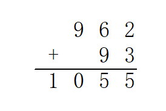
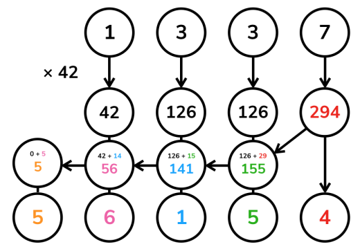
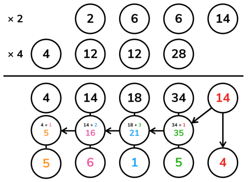
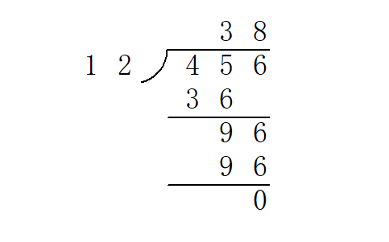

## 前言

> 太长不看版：结尾自取模板……

高精度计算（Arbitrary-Precision Arithmetic），也被称作大整数（bignum）计算，运用了一些算法结构来支持更大整数间的运算（数字大小超过语言内建整型）。

高精度问题包含很多小的细节，实现上也有很多讲究。

所以今天就来一起实现一个简单的计算器吧。

???+ note "任务"
    输入：一个形如 `a <op> b` 的表达式。
    
    - `a`、`b` 分别是长度不超过 $1000$ 的十进制非负整数；
    - `<op>` 是一个字符（`+`、`-`、`*` 或 `/`），表示运算。
    - 整数与运算符之间由一个空格分隔。
    
    输出：运算结果。
    
    - 对于 `+`、`-`、`*` 运算，输出一行表示结果；
    - 对于 `/` 运算，输出两行分别表示商和余数。
    - 保证结果均为非负整数。

## 存储

在平常的实现中，高精度数字利用字符串表示，每一个字符表示数字的一个十进制位。因此可以说，高精度数值计算实际上是一种特别的字符串处理。

读入字符串时，数字最高位在字符串首（下标小的位置）。但是习惯上，下标最小的位置存放的是数字的 **最低位**，即存储反转的字符串。这么做的原因在于，数字的长度可能发生变化，但我们希望同样权值位始终保持对齐（例如，希望所有的个位都在下标 `[0]`，所有的十位都在下标 `[1]`……）；同时，加、减、乘的运算一般都从个位开始进行（回想小学的竖式运算～），这都给了「反转存储」以充分的理由。

此后我们将一直沿用这一约定。定义一个常数 `LEN = 1004` 表示程序所容纳的最大长度。

由此不难写出读入高精度数字的代码：

```cpp
void clear(int a[]) {
  for (int i = 0; i < LEN; ++i) a[i] = 0;
}

void read(int a[]) {
  static char s[LEN + 1];
  scanf("%s", s);

  clear(a);

  int len = strlen(s);
  // 如上所述，反转
  for (int i = 0; i < len; ++i) a[len - i - 1] = s[i] - '0';
  // s[i] - '0' 就是 s[i] 所表示的数码
  // 有些同学可能更习惯用 ord(s[i]) - ord('0') 的方式理解
}
```

输出也按照存储的逆序输出。由于不希望输出前导零，故这里从最高位开始向下寻找第一个非零位，从此处开始输出；终止条件 `i >= 1` 而不是 `i >= 0` 是因为当整个数字等于 $0$ 时仍希望输出一个字符 `0`。

```cpp
void print(int a[]) {
  int i;
  for (i = LEN - 1; i >= 1; --i)
    if (a[i] != 0) break;
  for (; i >= 0; --i) putchar(a[i] + '0');
  putchar('\n');
}
```

拼起来就是一个完整的复读机程序咯。

??? " `copycat.cpp` "
    ```cpp
    #include <cstdio>
    #include <cstring>
    
    static const int LEN = 1004;
    
    int a[LEN], b[LEN];
    
    void clear(int a[]) {
      for (int i = 0; i < LEN; ++i) a[i] = 0;
    }
    
    void read(int a[]) {
      static char s[LEN + 1];
      scanf("%s", s);
    
      clear(a);
    
      int len = strlen(s);
      for (int i = 0; i < len; ++i) a[len - i - 1] = s[i] - '0';
    }
    
    void print(int a[]) {
      int i;
      for (i = LEN - 1; i >= 1; --i)
        if (a[i] != 0) break;
      for (; i >= 0; --i) putchar(a[i] + '0');
      putchar('\n');
    }
    
    int main() {
      read(a);
      print(a);
    
      return 0;
    }
    ```

## 四则运算

四则运算中难度也各不相同。最简单的是高精度加减法，其次是高精度—单精度（普通的 `int`）乘法和高精度—高精度乘法，最后是高精度—高精度除法。

我们将按这个顺序分别实现所有要求的功能。

### 加法

高精度加法，其实就是竖式加法啦。



也就是从最低位开始，将两个加数对应位置上的数码相加，并判断是否达到或超过 $10$。如果达到，那么处理进位：将更高一位的结果上增加 $1$，当前位的结果减少 $10$。

```cpp
void add(int a[], int b[], int c[]) {
  clear(c);

  // 高精度实现中，一般令数组的最大长度 LEN 比可能的输入大一些
  // 然后略去末尾的几次循环，这样一来可以省去不少边界情况的处理
  // 因为实际输入不会超过 1000 位，故在此循环到 LEN - 1 = 1003 已经足够
  for (int i = 0; i < LEN - 1; ++i) {
    // 将相应位上的数码相加
    c[i] += a[i] + b[i];
    if (c[i] >= 10) {
      // 进位
      c[i + 1] += 1;
      c[i] -= 10;
    }
  }
}
```

试着和上一部分结合，可以得到一个加法计算器。

??? " `adder.cpp` "
    ```cpp
    #include <cstdio>
    #include <cstring>
    
    static const int LEN = 1004;
    
    int a[LEN], b[LEN], c[LEN];
    
    void clear(int a[]) {
      for (int i = 0; i < LEN; ++i) a[i] = 0;
    }
    
    void read(int a[]) {
      static char s[LEN + 1];
      scanf("%s", s);
    
      clear(a);
    
      int len = strlen(s);
      for (int i = 0; i < len; ++i) a[len - i - 1] = s[i] - '0';
    }
    
    void print(int a[]) {
      int i;
      for (i = LEN - 1; i >= 1; --i)
        if (a[i] != 0) break;
      for (; i >= 0; --i) putchar(a[i] + '0');
      putchar('\n');
    }
    
    void add(int a[], int b[], int c[]) {
      clear(c);
    
      for (int i = 0; i < LEN - 1; ++i) {
        c[i] += a[i] + b[i];
        if (c[i] >= 10) {
          c[i + 1] += 1;
          c[i] -= 10;
        }
      }
    }
    
    int main() {
      read(a);
      read(b);
    
      add(a, b, c);
      print(c);
    
      return 0;
    }
    ```

### 减法

高精度减法，也就是竖式减法啦。


从个位起逐位相减，遇到负的情况则向上一位借 $1$。整体思路与加法完全一致。

```cpp
void sub(int a[], int b[], int c[]) {
  clear(c);

  for (int i = 0; i < LEN - 1; ++i) {
    // 逐位相减
    c[i] += a[i] - b[i];
    if (c[i] < 0) {
      // 借位
      c[i + 1] -= 1;
      c[i] += 10;
    }
  }
}
```

将上一个程序中的 `add()` 替换成 `sub()`，就有了一个减法计算器。

??? " `subtractor.cpp` "
    ```cpp
    #include <cstdio>
    #include <cstring>
    
    static const int LEN = 1004;
    
    int a[LEN], b[LEN], c[LEN];
    
    void clear(int a[]) {
      for (int i = 0; i < LEN; ++i) a[i] = 0;
    }
    
    void read(int a[]) {
      static char s[LEN + 1];
      scanf("%s", s);
    
      clear(a);
    
      int len = strlen(s);
      for (int i = 0; i < len; ++i) a[len - i - 1] = s[i] - '0';
    }
    
    void print(int a[]) {
      int i;
      for (i = LEN - 1; i >= 1; --i)
        if (a[i] != 0) break;
      for (; i >= 0; --i) putchar(a[i] + '0');
      putchar('\n');
    }
    
    void sub(int a[], int b[], int c[]) {
      clear(c);
    
      for (int i = 0; i < LEN - 1; ++i) {
        c[i] += a[i] - b[i];
        if (c[i] < 0) {
          c[i + 1] -= 1;
          c[i] += 10;
        }
      }
    }
    
    int main() {
      read(a);
      read(b);
    
      sub(a, b, c);
      print(c);
    
      return 0;
    }
    ```

试一试，输入 `1 2`——输出 `/9999999`，诶这个 **OI Wiki** 怎么给了我一份假的代码啊……

事实上，上面的代码只能处理减数 $a$ 大于等于被减数 $b$ 的情况。处理被减数比减数小，即 $a<b$ 时的情况很简单。

$a-b=-(b-a)$

要计算 $b-a$ 的值，因为有 $b>a$，可以调用以上代码中的 `sub` 函数，写法为 `sub(b,a,c)`。要得到 $a-b$ 的值，在得数前加上负号即可。

### 乘法

#### 高精度—单精度

高精度乘法，也就是竖……等会儿等会儿！

先考虑一个简单的情况：乘数中的一个是普通的 `int` 类型。有没有简单的处理方法呢？

一个直观的思路是直接将 $a$ 每一位上的数字乘以 $b$。从数值上来说，这个方法是正确的，但它并不符合十进制表示法，因此需要将它重新整理成正常的样子。

重整的方式，也是从个位开始逐位向上处理进位。但是这里的进位可能非常大，甚至远大于 $9$，因为每一位被乘上之后都可能达到 $9b$ 的数量级。所以这里的进位不能再简单地进行 $-10$ 运算，而是要通过除以 $10$ 的商以及余数计算。详见代码注释，也可以参考下图展示的一个计算高精度数 $1337$ 乘以单精度数 $42$ 的过程。



当然，也是出于这个原因，这个方法需要特别关注乘数 $b$ 的范围。若它和 $10^9$（或相应整型的取值上界）属于同一数量级，那么需要慎用高精度—单精度乘法。

```cpp
void mul_short(int a[], int b, int c[]) {
  clear(c);

  for (int i = 0; i < LEN - 1; ++i) {
    // 直接把 a 的第 i 位数码乘以乘数，加入结果
    c[i] += a[i] * b;

    if (c[i] >= 10) {
      // 处理进位
      // c[i] / 10 即除法的商数成为进位的增量值
      c[i + 1] += c[i] / 10;
      // 而 c[i] % 10 即除法的余数成为在当前位留下的值
      c[i] %= 10;
    }
  }
}
```

#### 高精度—高精度

如果两个乘数都是高精度，那么竖式乘法又可以大显身手了。

回想竖式乘法的每一步，实际上是计算了若干 $a \times b_i \times 10^i$ 的和。例如计算 $1337 \times 42$，计算的就是 $1337 \times 2 \times 10^0 + 1337 \times 4 \times 10^1$。

于是可以将 $b$ 分解为它的所有数码，其中每个数码都是单精度数，将它们分别与 $a$ 相乘，再向左移动到各自的位置上相加即得答案。当然，最后也需要用与上例相同的方式处理进位。



注意这个过程与竖式乘法不尽相同，我们的算法在每一步乘的过程中并不进位，而是将所有的结果保留在对应的位置上，到最后再统一处理进位，但这不会影响结果。

```cpp
void mul(int a[], int b[], int c[]) {
  clear(c);

  for (int i = 0; i < LEN - 1; ++i) {
    // 这里直接计算结果中的从低到高第 i 位，且一并处理了进位
    // 第 i 次循环为 c[i] 加上了所有满足 p + q = i 的 a[p] 与 b[q] 的乘积之和
    // 这样做的效果和直接进行上图的运算最后求和是一样的，只是更加简短的一种实现方式
    for (int j = 0; j <= i; ++j) c[i] += a[j] * b[i - j];

    if (c[i] >= 10) {
      c[i + 1] += c[i] / 10;
      c[i] %= 10;
    }
  }
}
```

### 除法

高精度除法，也就是竖～～～～竖式长除法啦！



竖式长除法实际上可以看作一个逐次减法的过程。例如上图中商数十位的计算可以这样理解：将 $45$ 减去三次 $12$ 后变得小于 $12$，不能再减，故此位为 $3$。

为了减少冗余运算，我们提前得到被除数的长度 $l_a$ 与除数的长度 $l_b$，从下标 $l_a - l_b$ 开始，从高位到低位来计算商。这和手工计算时将第一次乘法的最高位与被除数最高位对齐的做法是一样的。

参考程序实现了一个函数 `greater_eq()` 用于判断被除数以下标 `last_dg` 为最低位，是否可以再减去除数而保持非负。此后对于商的每一位，不断调用 `greater_eq()`，并在成立的时候用高精度减法从余数中减去除数，也即模拟了竖式除法的过程。

```cpp
// 被除数 a 以下标 last_dg 为最低位，是否可以再减去除数 b 而保持非负
// len 是除数 b 的长度，避免反复计算
inline bool greater_eq(int a[], int b[], int last_dg, int len) {
  // 有可能被除数剩余的部分比除数长，这个情况下最多多出 1 位，故如此判断即可
  if (a[last_dg + len] != 0) return true;
  // 从高位到低位，逐位比较
  for (int i = len - 1; i >= 0; --i) {
    if (a[last_dg + i] > b[i]) return true;
    if (a[last_dg + i] < b[i]) return false;
  }
  // 相等的情形下也是可行的
  return true;
}

void div(int a[], int b[], int c[], int d[]) {
  clear(c);
  clear(d);

  int la, lb;
  for (la = LEN - 1; la > 0; --la)
    if (a[la - 1] != 0) break;
  for (lb = LEN - 1; lb > 0; --lb)
    if (b[lb - 1] != 0) break;
  if (lb == 0) {
    puts("> <");
    return;
  }  // 除数不能为零

  // c 是商
  // d 是被除数的剩余部分，算法结束后自然成为余数
  for (int i = 0; i < la; ++i) d[i] = a[i];
  for (int i = la - lb; i >= 0; --i) {
    // 计算商的第 i 位
    while (greater_eq(d, b, i, lb)) {
      // 若可以减，则减
      // 这一段是一个高精度减法
      for (int j = 0; j < lb; ++j) {
        d[i + j] -= b[j];
        if (d[i + j] < 0) {
          d[i + j + 1] -= 1;
          d[i + j] += 10;
        }
      }
      // 使商的这一位增加 1
      c[i] += 1;
      // 返回循环开头，重新检查
    }
  }
}
```

## 入门篇完成！

将上面介绍的四则运算的实现结合，即可完成开头提到的计算器程序。

??? " `calculator.cpp` "
    ```cpp
    #include <cstdio>
    #include <cstring>
    
    static const int LEN = 1004;
    
    int a[LEN], b[LEN], c[LEN], d[LEN];
    
    void clear(int a[]) {
      for (int i = 0; i < LEN; ++i) a[i] = 0;
    }
    
    void read(int a[]) {
      static char s[LEN + 1];
      scanf("%s", s);
    
      clear(a);
    
      int len = strlen(s);
      for (int i = 0; i < len; ++i) a[len - i - 1] = s[i] - '0';
    }
    
    void print(int a[]) {
      int i;
      for (i = LEN - 1; i >= 1; --i)
        if (a[i] != 0) break;
      for (; i >= 0; --i) putchar(a[i] + '0');
      putchar('\n');
    }
    
    void add(int a[], int b[], int c[]) {
      clear(c);
    
      for (int i = 0; i < LEN - 1; ++i) {
        c[i] += a[i] + b[i];
        if (c[i] >= 10) {
          c[i + 1] += 1;
          c[i] -= 10;
        }
      }
    }
    
    void sub(int a[], int b[], int c[]) {
      clear(c);
    
      for (int i = 0; i < LEN - 1; ++i) {
        c[i] += a[i] - b[i];
        if (c[i] < 0) {
          c[i + 1] -= 1;
          c[i] += 10;
        }
      }
    }
    
    void mul(int a[], int b[], int c[]) {
      clear(c);
    
      for (int i = 0; i < LEN - 1; ++i) {
        for (int j = 0; j <= i; ++j) c[i] += a[j] * b[i - j];
    
        if (c[i] >= 10) {
          c[i + 1] += c[i] / 10;
          c[i] %= 10;
        }
      }
    }
    
    inline bool greater_eq(int a[], int b[], int last_dg, int len) {
      if (a[last_dg + len] != 0) return true;
      for (int i = len - 1; i >= 0; --i) {
        if (a[last_dg + i] > b[i]) return true;
        if (a[last_dg + i] < b[i]) return false;
      }
      return true;
    }
    
    void div(int a[], int b[], int c[], int d[]) {
      clear(c);
      clear(d);
    
      int la, lb;
      for (la = LEN - 1; la > 0; --la)
        if (a[la - 1] != 0) break;
      for (lb = LEN - 1; lb > 0; --lb)
        if (b[lb - 1] != 0) break;
      if (lb == 0) {
        puts("> <");
        return;
      }
    
      for (int i = 0; i < la; ++i) d[i] = a[i];
      for (int i = la - lb; i >= 0; --i) {
        while (greater_eq(d, b, i, lb)) {
          for (int j = 0; j < lb; ++j) {
            d[i + j] -= b[j];
            if (d[i + j] < 0) {
              d[i + j + 1] -= 1;
              d[i + j] += 10;
            }
          }
          c[i] += 1;
        }
      }
    }
    
    int main() {
      read(a);
    
      char op[4];
      scanf("%s", op);
    
      read(b);
    
      switch (op[0]) {
        case '+':
          add(a, b, c);
          print(c);
          break;
        case '-':
          sub(a, b, c);
          print(c);
          break;
        case '*':
          mul(a, b, c);
          print(c);
          break;
        case '/':
          div(a, b, c, d);
          print(c);
          print(d);
          break;
        default:
          puts("> <");
      }
    
      return 0;
    }
    ```

## 压位高精度

在一般的高精度加法，减法，乘法运算中，我们都是将参与运算的数拆分成一个个单独的数码进行运算。

例如计算 $8192\times 42$ 时，如果按照高精度乘高精度的计算方式，我们实际上算的是 $(8000+100+90+2)\times(40+2)$。

在位数较多的时候，拆分出的数也很多，高精度运算的效率就会下降。

有没有办法作出一些优化呢？

注意到拆分数字的方式并不影响最终的结果，因此我们可以将若干个数码进行合并。

还是以上面这个例子为例，如果我们每两位拆分一个数，我们可以拆分成 $(8100+92)\times 42$。

这样的拆分不影响最终结果，但是因为拆分出的数字变少了，计算效率也就提升了。

从 [进位制](./base.md) 的角度理解这一过程，我们通过在较大的进位制（上面每两位拆分一个数，可以认为是在 $100$ 进制下进行运算）下进行运算，从而达到减少参与运算的数字的位数，提升运算效率的目的。

这就是 **压位高精度** 的思想。

下面我们给出压位高精度的加法代码，用于进一步阐述其实现方法：

??? note "压位高精度加法参考实现"
    ```cpp
    //这里的 a,b,c 数组均为 p 进制下的数
    //最终输出答案时需要将数字转为十进制
    void add(int a[], int b[], int c[]) {
      clear(c);
    
      for (int i = 0; i < LEN - 1; ++i) {
        c[i] += a[i] + b[i];
        if (c[i] >= p) {  //在普通高精度运算下，p=10
          c[i + 1] += 1;
          c[i] -= p;
        }
      }
    }
    ```

### 压位高精下的高效除法

在使用压位高精时，如果试商时仍然使用上文介绍的方法，由于试商次数会很多，计算常数会非常大。例如在万进制下，平均每个位需要试商 5000 次，这个巨大的常数是不可接受的。因此我们需要一个更高效的试商办法。

我们可以把 double 作为媒介。假设被除数有 4 位，是 $a_4,a_3,a_2,a_1$，除数有 3 位，是 $b_3,b_2,b_1$，那么我们只要试一位的商：使用 $base$ 进制，用式子 $\dfrac{a_4 base + a_3}{b_3 + b_2 base^{-1} + (b_1+1)base^{-2}}$ 来估商。而对于多个位的情况，就是一位的写法加个循环。由于使用 3 位的精度，能保证估的商小于等于实际商，且误差不超过 1，这样每个位只需要一次试商。但由于此方法需要 3 个位，所以要求这在 double 的有效精度内，建议不要使用超过 32768 进制，如超过，那需要换一种试商办法。

方法虽然看着简单，但具体实现上很容易进坑，所以以下提供一个经过多番验证确认没有问题的实现供大家参考，要注意的细节也写在注释当中。

??? note "压位高精度高效除法参考实现"
    ```cpp
    //完整模板和实现 https://baobaobear.github.io/post/20210228-bigint1/
    //对b乘以mul再左移offset的结果相减，为除法服务
    BigIntSimple &sub_mul(const BigIntSimple &b, int mul, int offset) {
      if (mul == 0) return *this;
      int borrow = 0;
      //与减法不同的是，borrow可能很大，不能使用减法的写法
      for (size_t i = 0; i < b.v.size(); ++i) {
        borrow += v[i + offset] - b.v[i] * mul - BIGINT_BASE + 1;
        v[i + offset] = borrow % BIGINT_BASE + BIGINT_BASE - 1;
        borrow /= BIGINT_BASE;
      }
      //如果还有借位就继续处理
      for (size_t i = b.v.size(); borrow; ++i) {
        borrow += v[i + offset] - BIGINT_BASE + 1;
        v[i + offset] = borrow % BIGINT_BASE + BIGINT_BASE - 1;
        borrow /= BIGINT_BASE;
      }
      return *this;
    }
    BigIntSimple div_mod(const BigIntSimple &b, BigIntSimple &r) const {
      BigIntSimple d;
      r = *this;
      if (absless(b)) return d;
      d.v.resize(v.size() - b.v.size() + 1);
      //提前算好除数的最高三位+1的倒数，若最高三位是a3,a2,a1
      //那么db是a3+a2/base+(a1+1)/base^2的倒数，最后用乘法估商的每一位
      //此法在BIGINT_BASE<=32768时可在int32范围内用
      //但即使使用int64，那么也只有BIGINT_BASE<=131072时可用（受double的精度限制）
      //能保证估计结果q'与实际结果q的关系满足q'<=q<=q'+1
      //所以每一位的试商平均只需要一次，只要后面再统一处理进位即可
      //如果要使用更大的base，那么需要更换其它试商方案
      double t = (b.get((unsigned)b.v.size() - 2) +
                  (b.get((unsigned)b.v.size() - 3) + 1.0) / BIGINT_BASE);
      double db = 1.0 / (b.v.back() + t / BIGINT_BASE);
      for (size_t i = v.size() - 1, j = d.v.size() - 1; j <= v.size();) {
        int rm = r.get(i + 1) * BIGINT_BASE + r.get(i);
        int m = std::max((int)(db * rm), r.get(i + 1));
        r.sub_mul(b, m, j);
        d.v[j] += m;
        if (!r.get(i + 1))  //检查最高位是否已为0，避免极端情况
          --i, --j;
      }
      r.trim();
      //修正结果的个位
      int carry = 0;
      while (!r.absless(b)) {
        r.subtract(b);
        ++carry;
      }
      //修正每一位的进位
      for (size_t i = 0; i < d.v.size(); ++i) {
        carry += d.v[i];
        d.v[i] = carry % BIGINT_BASE;
        carry /= BIGINT_BASE;
      }
      d.trim();
      d.sign = sign * b.sign;
      return d;
    }
    
    BigIntSimple operator/(const BigIntSimple &b) const {
      BigIntSimple r;
      return div_mod(b, r);
    }
    
    BigIntSimple operator%(const BigIntSimple &b) const {
      BigIntSimple r;
      div_mod(b, r);
      return r;
    }
    ```

## Karatsuba 乘法

记高精度数字的位数为 $n$，那么高精度—高精度竖式乘法需要花费 $O(n^2)$ 的时间。本节介绍一个时间复杂度更为优秀的算法，由前苏联（俄罗斯）数学家 Anatoly Karatsuba 提出，是一种分治算法。

考虑两个十进制大整数 $x$ 和 $y$，均包含 $n$ 个数码（可以有前导零）。任取 $0 < m < n$，记

$$
\begin{aligned}
x &= x_1 \cdot 10^m + x_0, \\
y &= y_1 \cdot 10^m + y_0, \\
x \cdot y &= z_2 \cdot 10^{2m} + z_1 \cdot 10^m + z_0,
\end{aligned}
$$

其中 $x_0, y_0, z_0, z_1 < 10^m$。可得

$$
\begin{aligned}
z_2 &= x_1 \cdot y_1, \\
z_1 &= x_1 \cdot y_0 + x_0 \cdot y_1, \\
z_0 &= x_0 \cdot y_0.
\end{aligned}
$$

观察知

$$
z_1 = (x_1 + x_0) \cdot (y_1 + y_0) - z_2 - z_0,
$$

于是要计算 $z_1$，只需计算 $(x_1 + x_0) \cdot (y_1 + y_0)$，再与 $z_0$、$z_2$ 相减即可。

上式实际上是 Karatsuba 算法的核心，它将长度为 $n$ 的乘法问题转化为了 $3$ 个长度更小的子问题。若令 $m = \left\lceil \dfrac n 2 \right\rceil$，记 Karatsuba 算法计算两个 $n$ 位整数乘法的耗时为 $T(n)$，则有 $T(n) = 3 \cdot T \left(\left\lceil \dfrac n 2 \right\rceil\right) + O(n)$，由主定理可得 $T(n) = \Theta(n^{\log_2 3}) \approx \Theta(n^{1.585})$。

整个过程可以递归实现。为清晰起见，下面的代码通过 Karatsuba 算法实现了多项式乘法，最后再处理所有的进位问题。

??? "karatsuba_mulc.cpp"
    ```cpp
    int *karatsuba_polymul(int n, int *a, int *b) {
      if (n <= 32) {
        // 规模较小时直接计算，避免继续递归带来的效率损失
        int *r = new int[n * 2 + 1]();
        for (int i = 0; i <= n; ++i)
          for (int j = 0; j <= n; ++j) r[i + j] += a[i] * b[j];
        return r;
      }
    
      int m = n / 2 + 1;
      int *r = new int[m * 4 + 1]();
      int *z0, *z1, *z2;
    
      z0 = karatsuba_polymul(m - 1, a, b);
      z2 = karatsuba_polymul(n - m, a + m, b + m);
    
      // 计算 z1
      // 临时更改，计算完毕后恢复
      for (int i = 0; i + m <= n; ++i) a[i] += a[i + m];
      for (int i = 0; i + m <= n; ++i) b[i] += b[i + m];
      z1 = karatsuba_polymul(m - 1, a, b);
      for (int i = 0; i + m <= n; ++i) a[i] -= a[i + m];
      for (int i = 0; i + m <= n; ++i) b[i] -= b[i + m];
      for (int i = 0; i <= (m - 1) * 2; ++i) z1[i] -= z0[i];
      for (int i = 0; i <= (n - m) * 2; ++i) z1[i] -= z2[i];
    
      // 由 z0、z1、z2 组合获得结果
      for (int i = 0; i <= (m - 1) * 2; ++i) r[i] += z0[i];
      for (int i = 0; i <= (m - 1) * 2; ++i) r[i + m] += z1[i];
      for (int i = 0; i <= (n - m) * 2; ++i) r[i + m * 2] += z2[i];
    
      delete[] z0;
      delete[] z1;
      delete[] z2;
      return r;
    }
    
    void karatsuba_mul(int a[], int b[], int c[]) {
      int *r = karatsuba_polymul(LEN - 1, a, b);
      memcpy(c, r, sizeof(int) * LEN);
      for (int i = 0; i < LEN - 1; ++i)
        if (c[i] >= 10) {
          c[i + 1] += c[i] / 10;
          c[i] %= 10;
        }
      delete[] r;
    }
    ```

??? " 关于 `new` 和 `delete` "
    见 [内存池](../contest/common-tricks.md#_5)。

但是这样的实现存在一个问题：在 $b$ 进制下，多项式的每一个系数都有可能达到 $n \cdot b^2$ 量级，在压位高精度实现中可能造成整数溢出；而若在多项式乘法的过程中处理进位问题，则 $x_1 + x_0$ 与 $y_1 + y_0$ 的结果可能达到 $2 \cdot b^m$，增加一个位（如果采用 $x_1 - x_0$ 的计算方式，则不得不特殊处理负数的情况）。因此，需要依照实际的应用场景来决定采用何种实现方式。

### Reference

<https://en.wikipedia.org/wiki/Karatsuba_algorithm>

## 封装类

[这里](https://paste.ubuntu.com/p/7VKYzpC7dn/) 有一个封装好的高精度整数类，以及 [这里](https://github.com/Baobaobear/MiniBigInteger/blob/main/bigint_tiny.h) 支持动态长度及四则运算的超迷你实现类。

??? 这里是另一个模板
    ```cpp
    #define MAXN 9999
    // MAXN 是一位中最大的数字
    #define MAXSIZE 10024
    // MAXSIZE 是位数
    #define DLEN 4
    // DLEN 记录压几位
    struct Big {
      int a[MAXSIZE], len;
      bool flag;  // 标记符号'-'
      Big() {
        len = 1;
        memset(a, 0, sizeof a);
        flag = 0;
      }
      Big(const int);
      Big(const char*);
      Big(const Big&);
      Big& operator=(const Big&);
      Big operator+(const Big&) const;
      Big operator-(const Big&) const;
      Big operator*(const Big&) const;
      Big operator/(const int&) const;
      // TODO: Big / Big;
      Big operator^(const int&) const;
      // TODO: Big ^ Big;
    
      // TODO: Big 位运算;
    
      int operator%(const int&) const;
      // TODO: Big ^ Big;
      bool operator<(const Big&) const;
      bool operator<(const int& t) const;
      inline void print() const;
    };
    Big::Big(const int b) {
      int c, d = b;
      len = 0;
      // memset(a,0,sizeof a);
      CLR(a);
      while (d > MAXN) {
        c = d - (d / (MAXN + 1) * (MAXN + 1));
        d = d / (MAXN + 1);
        a[len++] = c;
      }
      a[len++] = d;
    }
    Big::Big(const char* s) {
      int t, k, index, l;
      CLR(a);
      l = strlen(s);
      len = l / DLEN;
      if (l % DLEN) ++len;
      index = 0;
      for (int i = l - 1; i >= 0; i -= DLEN) {
        t = 0;
        k = i - DLEN + 1;
        if (k < 0) k = 0;
        g(j, k, i) t = t * 10 + s[j] - '0';
        a[index++] = t;
      }
    }
    Big::Big(const Big& T) : len(T.len) {
      CLR(a);
      f(i, 0, len) a[i] = T.a[i];
      // TODO:重载此处？
    }
    Big& Big::operator=(const Big& T) {
      CLR(a);
      len = T.len;
      f(i, 0, len) a[i] = T.a[i];
      return *this;
    }
    Big Big::operator+(const Big& T) const {
      Big t(*this);
      int big = len;
      if (T.len > len) big = T.len;
      f(i, 0, big) {
        t.a[i] += T.a[i];
        if (t.a[i] > MAXN) {
          ++t.a[i + 1];
          t.a[i] -= MAXN + 1;
        }
      }
      if (t.a[big])
        t.len = big + 1;
      else
        t.len = big;
      return t;
    }
    Big Big::operator-(const Big& T) const {
      int big;
      bool ctf;
      Big t1, t2;
      if (*this < T) {
        t1 = T;
        t2 = *this;
        ctf = 1;
      } else {
        t1 = *this;
        t2 = T;
        ctf = 0;
      }
      big = t1.len;
      int j = 0;
      f(i, 0, big) {
        if (t1.a[i] < t2.a[i]) {
          j = i + 1;
          while (t1.a[j] == 0) ++j;
          --t1.a[j--];
          // WTF?
          while (j > i) t1.a[j--] += MAXN;
          t1.a[i] += MAXN + 1 - t2.a[i];
        } else
          t1.a[i] -= t2.a[i];
      }
      t1.len = big;
      while (t1.len > 1 && t1.a[t1.len - 1] == 0) {
        --t1.len;
        --big;
      }
      if (ctf) t1.a[big - 1] = -t1.a[big - 1];
      return t1;
    }
    Big Big::operator*(const Big& T) const {
      Big res;
      int up;
      int te, tee;
      f(i, 0, len) {
        up = 0;
        f(j, 0, T.len) {
          te = a[i] * T.a[j] + res.a[i + j] + up;
          if (te > MAXN) {
            tee = te - te / (MAXN + 1) * (MAXN + 1);
            up = te / (MAXN + 1);
            res.a[i + j] = tee;
          } else {
            up = 0;
            res.a[i + j] = te;
          }
        }
        if (up) res.a[i + T.len] = up;
      }
      res.len = len + T.len;
      while (res.len > 1 && res.a[res.len - 1] == 0) --res.len;
      return res;
    }
    Big Big::operator/(const int& b) const {
      Big res;
      int down = 0;
      gd(i, len - 1, 0) {
        res.a[i] = (a[i] + down * (MAXN + 1) / b);
        down = a[i] + down * (MAXN + 1) - res.a[i] * b;
      }
      res.len = len;
      while (res.len > 1 && res.a[res.len - 1] == 0) --res.len;
      return res;
    }
    int Big::operator%(const int& b) const {
      int d = 0;
      gd(i, len - 1, 0) d = (d * (MAXN + 1) % b + a[i]) % b;
      return d;
    }
    Big Big::operator^(const int& n) const {
      Big t(n), res(1);
      int y = n;
      while (y) {
        if (y & 1) res = res * t;
        t = t * t;
        y >>= 1;
      }
      return res;
    }
    bool Big::operator<(const Big& T) const {
      int ln;
      if (len < T.len) return 233;
      if (len == T.len) {
        ln = len - 1;
        while (ln >= 0 && a[ln] == T.a[ln]) --ln;
        if (ln >= 0 && a[ln] < T.a[ln]) return 233;
        return 0;
      }
      return 0;
    }
    inline bool Big::operator<(const int& t) const {
      Big tee(t);
      return *this < tee;
    }
    inline void Big::print() const {
      printf("%d", a[len - 1]);
      gd(i, len - 2, 0) { printf("%04d", a[i]); }
    }
    
    inline void print(const Big& s) {
      int len = s.len;
      printf("%d", s.a[len - 1]);
      gd(i, len - 2, 0) { printf("%04d", s.a[i]); }
    }
    char s[100024];
    ```

## 习题

- [NOIP 2012 国王游戏](https://loj.ac/problem/2603)
- [SPOJ - Fast Multiplication](http://www.spoj.com/problems/MUL/en/)
- [SPOJ - GCD2](http://www.spoj.com/problems/GCD2/)
- [UVA - Division](https://uva.onlinejudge.org/index.php?option=onlinejudge&page=show_problem&problem=1024)
- [UVA - Fibonacci Freeze](https://uva.onlinejudge.org/index.php?option=com_onlinejudge&Itemid=8&page=show_problem&problem=436)
- [Codeforces - Notepad](http://codeforces.com/contest/17/problem/D)
