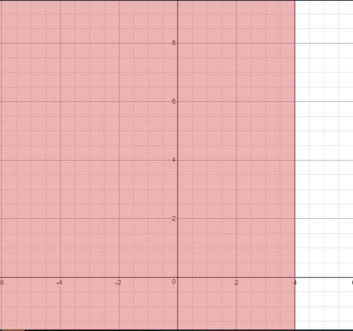
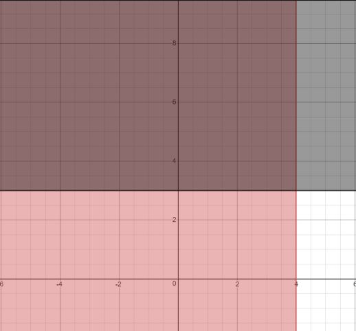
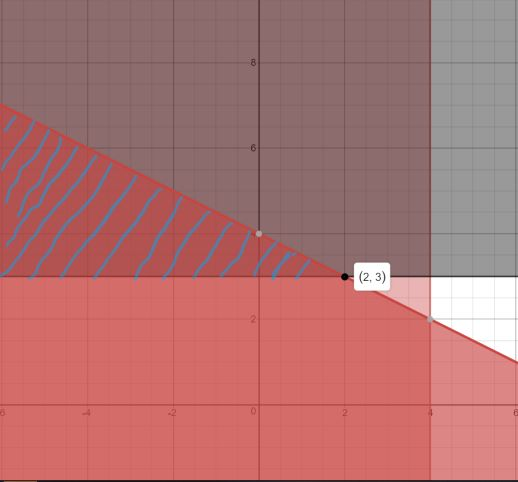

## 线性规划

### 定义

研究线性约束条件下线性目标函数极值问题的方法总称，是运筹学的一个分支，在多方面均有应用。线性规划的某些特殊情况，如网络流、多商品流量等问题都有可能作为 OI 问题出现

### 线性规划问题的描述

一个问题要能转化为线性规划问题，首先需要有一个或多个线性约束条件，然后要求的目标函数也应该是线性的。那么，最容易也是最常用的描述方法就是标准型。

我们以[《算法导论》](https://mitpress.ublish.com/ereader/1/?preview#page/Cover)中线性规划一节提出的问题为例：

> 假如你是一位政治家，试图赢得一场选举，你的选区有三种：市区，郊区和乡村，这些选区分别有 100000、200000 和 50000 个选民，尽管并不是所有人都有足够的社会责任感去投票，你还是希望每个选区至少有半数选民投票以确保你可以当选
>
> 显而易见的，你是一个正直、可敬的人，然而你意识到，在某些选区，某些议题可以更有效的赢取选票。你的首要议题是修筑更多的道路、枪支管制、农场补贴以及调整汽油税。你的竞选班子可以为你估测每花费 $1000 做广告，在每个选区可以赢取或者失去的选票的数量（千人），如下表所示：

| 政策   | 市区  | 郊区  | 乡村  |
| ---- | --- | --- | --- |
| 修路   | -2  | 5   | 3   |
| 枪支管制 | 8   | 2   | -5  |
| 农场补贴 | 0   | 0   | 10  |
| 汽油税  | 10  | 0   | -2  |

你的目标是计算出要在市区，郊区和乡村分别获得至少 50000，100000 和 25000 张选票所花费的最少钱数

我们可以使用数学语言来描述它：

​	设 $x_1$ 为花费在修路广告上的钱（千美元）

​	设 $x_2$ 为花费在枪支管制广告上的钱（千美元）

​	设 $x_3$ 为花费在农场补贴广告上的钱​（千美元）

​	设 $x_4$ 为花费在汽油税广告上的钱（千美元）

那么我们可以将在市区获得至少 50000 张市区选票表述为

​ $-2x_1+8x_2+0x_3+10x_4\geq50​$ 

同样的，在郊区获得至少 100000 张选票和在乡村获得至少 25000 张选票可以表示为

​ $5x_1+2x_2+0x_3+0x_4\geq100​$ 

​ $3x_1-5x_2+10x_3-2x_4\geq25​$ 

显而易见的，广告服务提供商不会倒贴钱给你然后做反向广告，由此可得

​ $x_1,x_2,x_3,x_4\geq0​$ 

又因为我们的目标是使总费用最小，综上所述，原问题可以表述为：

最小化 $x_1,x_2,x_3,x_4$ ,

满足

​ $-2x_1+8x_2+0x_3+10x_4\geq50​$ 

​ $5x_1+2x_2+0x_3+0x_4\geq100$ 

​ $3x_1-5x_2+10x_3-2x_4\geq25​$ 

​ $x_1,x_2,x_3,x_4\geq0$ 

这个线性规划的解就是这个问题的最优策略

用更具有普遍性的语言说：

已知一组实数 $[a_1..a_n]​$ 和一组变量 $[x_1..x_n]​$ , 在定义上有函数 $f(x_1..x_n)=\sum_{i=1}^na_ix_i​$ 

显而易见的，这个函数是线性的。如果 b 是一个实数而满足 $f(x_1..x_n)=b$ , 则这个等式被称为线性等式，同样的，满足 $f(x_1..x_n)\leq b$ 或者 $f(x_1..x_n)\geq b$ 则称之为线性不等式

在线性规划问题中，线性等式和线性不等式统称为线性约束。

一个线性规划问题是一个线性函数的极值问题，而这个线性函数应该服从于一个或者多个线性约束。

### 图解法

上面那个问题中变量较多，不便于使用图解法，所以用下面的问题来介绍图解法：

最小化 $x,y$ 

满足

​ $x+2y\leq8 ​$ 

​ $x\leq4 ​$ 

​ $y\geq3 ​$ 

​ $x,y\in N​$ 

知道这些约束条件以后，我们需要将它们在平面直角坐标系中画出来

 $x\leq4$ （红色区域）



 $y\geq3$ （黑色区域）



 $x+2y\leq8$ （深红色区域以及包含于 $\geq4$ 区域的浅红色区域）



显而易见的，打了蓝色斜线的区域为三块区域的交集，这就是这个线性规划的所有可行解。因为题目中说明，需要最小化 x 和 y，观察图像可知，点（2.3）为可行解中 x 和 y 最小的一个。因此， $x_{min}=2,y_{min}=3$ 

把求解线性规划的图解法总结起来，就是先在坐标系中作出所有的约束条件，然后作出需要求极值的线性函数的定义域。定义域与约束条件的交集就是这个线性规划的解集，而所需求的极值由观察可以轻易得出。

### 单纯形法

> $$
> \forall k,\sum_{i}a_{k,i}x_i\le b_{k}\\
> \forall i,x_i\ge 0
> $$
>
> 求
>
> $$
> \max(\sum_{i}c_{i}x_i)
> $$

我们考虑一个下标从 $0$ 开始的矩阵 $A_{0\sim m,0\sim n+m}$ :

$$
A=
\begin{bmatrix}
0 & c_1 & \ldots & c_n & 0 & 0 & \ldots & 0 \\
b_1 & a_{1,1} & \ldots & a_{1,n} & 1 & 0 & \dots & 0 \\
b_2 & a_{2,1} & \ldots & a_{2,n} & 0 & 1 & \dots & 0 \\
\vdots & \vdots & \ddots & \vdots & \vdots & \vdots & \ddots & \vdots \\
b_m & a_{m,1} & \ldots & a_{m,n} & 0 & 0 & \dots & 1
\end{bmatrix}
$$

其中 $A_{0,0}$ 为这个状态和初始时答案之差，新增的 $m$ 行相当于新建 $m$ 个变量，编号为 $x_{n+1\sim n+m}$ ，要求它们不小于 $0$ 

于是

$$
\forall i\in[1,m]\\
\sum_{1\le j\le n+m}a_{i,j}x_j=b_i
$$

显然，要先求出一套可行的方案

如果

$$
x_i=\begin{cases}0 & i\in[1,n]\\b_{i-n} & i\in[n+1,n+m]\end{cases}
$$

那么显然满足，但是由于 $b_i$ 不一定不小于 $0$ ，所以这样可能导致 $x_{i}$ 小于 $0$ 

然后，介绍一个魔法，通过矩阵变化改变 $b$ 的值来求合法解/最优解

#### 转轴

~~之所以叫这个名称，是因为可行域是一个超立方体，这个魔法是经过一条轴，但是我不讲~~

这个魔法是指：

选择两个数 $u,v$ ，考虑将 $x_v$ 变为非 $0$ 数而 $x_{u+n}$ 变为 $0$ ，也就是让 $x_v$ 来代替 $x_{u+n}$ 作为等于 $b_u$ 的位置。

如果要实现，就要运用矩阵变换。

我们可以先让第 $u$ 行全部除一个 $A_{u,v}$ ，然后把其它所有行 $i$ 的位置 $v$ 变为 $0$ （即使 $A_{i,v}=0$ ），可以直接把第 $i$ 行减去 $A_{i,v}$ 倍第 $u$ 行

然后就可以了！

因为（不算 $u+n,v$ 列的话）后面 $m$ 列只有 $A_{i,i+n}=1$ ，前面 $n$ 列都是 $0$ ，所以矩阵变化不会影响其它的 $x$ 。

当然，最好把第 $u+n,v$ 行换一下，这样会方便很多

（还有，因为矩阵后 $m$ 列值的特殊性，一般不存这 $m$ 列）

顺便一提，这对答案的贡献为：

$$
\dfrac{A_{0,v}A_{u,0}}{A_{u,v}}
$$

```cpp
int id[N << 1];
double a[N][N];
void pivot(int u, int v) {
  double k = a[u][v];
  swap(id[u + n], id[v]);
  a[u][v] =
      1.;  //已经知道第v列要被消掉了，就可以直接变为u+n列了（尽管要用一遍，就临时存一下）
  for (int i = 0; i <= n; i++) a[u][i] /= k;
  for (int i = 0; i <= m; i++)
    if (i != u && fabs(a[i][v]) > eps) {
      k = a[i][v];
      a[i][v] = 0;  //同上
      for (int j = 0; j <= n; j++) a[i][j] -= k * a[u][i];
    }
}
```

知道了基本的变（魔）化（法），就来看怎么求一个合法解

#### 初始化

引用一下 Candy? 的博客

> 算法导论上有一个辅助线性规划的做法
>
> 但我发现好多人都用了 **随机初始化** 的黑科技
>
> 在所有 $a_{i,0}<0$ 的约束中随机选一个作为 $u$ ，再随机选一个 $a_{u,v}<0$ 作为 $v$ ，然后 `pivot(u,v)` 后 $a_{i,0}$ 就变正了……

但这可能出现循环，然后不断损精度，然后 WA/TLE，总之很玄学就对了

但是有「优先前面/后面」的选择倾向再加以小随机效果似乎不错

```cpp
int init() {
  while (1) {
    int u = 0, v = 0;
    for (int i = 1; i <= m; i++)
      if (a[i][0] < -eps && (!u || rand() % 3 == 0)) u = i;
    if (!u)  //说明这个解是可行解
      return 1;
    for (int i = 1; i <= n; i++)
      if (a[u][i] < -eps && (!v || rand() % 3 == 0)) v = i;
    if (!v) {  //说明无解
      printf("Infeasible\n");
      return 0;
    }
    pivot(u, v);
  }
}
```

#### 求解

每次找到一个 $v$ 使得 $A_{0,v}>0$ ，再找到一个 $u$ 使得 $A_{u,v}>0$ ，然后 `pivot(u,v)` 即可。

##### 退化

在旋转的过程中，可能会存在保持答案不变的情况，这种现象称为退化。

##### Bland 规则

在选择替入变量和替出变量的时候，我们总是选择满足条件的下标最小值。

-   替入变量 $v$ ：目标条件中，系数为正数（如果求最小值就是负数）的第一个作为替入变量
-   替出变量 $u$ ：对所有的约束条件中，选择对 $u$ 约束最紧的第一个（也就是 $\dfrac{A_{u,0}}{A_{u,v}}$ 最小的那个）

```cpp
int simplex() {
  while (1) {
    int u = 0, v = 0;
    double mi = inf;
    for (int i = 1; i <= n; i++)
      if (a[0][i] > eps) {
        v = i;
        return;
      }
    if (!v) return 1;
    for (int i = 1; i <= m; i++)
      if (a[i][v] > eps && a[i][0] / a[i][v] < mi) {  // bland法则
        mi = a[i][0] / a[i][v];
        u = i;
      }
    if (!u) {  //没有约束
      printf("Unbounded\n");
      return 0;
    }
    pivot(u, v);
  }
}
```

#### 其它说明

##### 为什么这能对

每次矩阵变化后的子问题是等价于初始问题的（易证）

并且这类问题有一个特殊性：它的可行域是凸的

意味着不会有除最优解外的局部最优解出现

##### 这能跑多大

~~心有多大，梦想有多大，它就能跑多大~~

对于这种玄学算法，鬼才知道它能跑多大。

不过一般来说， $nm\le10^6$ 是~~不~~可行的
