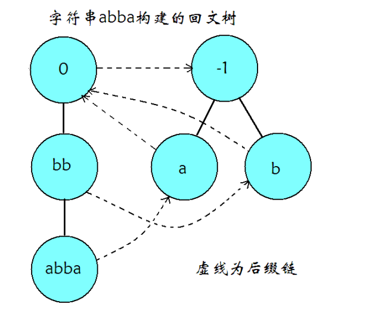
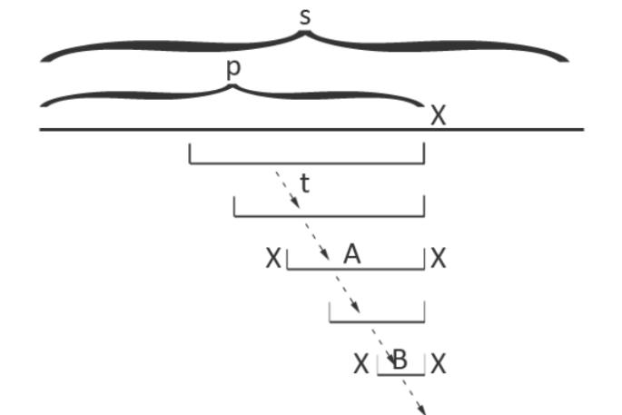

### 结构

回文树大概长这样



和其它自动机（但是它却叫「回文树」）类似的，它也是由转移边和 fail 指针组成，每个节点都可以代表所有对应它的回文子串。

因为回文串长度分为奇数和偶数，我们可以像 manacher 那样加入一个不在字符集中的字符（如 '#'）作为分隔符来将所有回文串的长度都变为奇数，但是这样过于麻烦了。有没有更好的办法呢?

答案自然是有。更好的办法就是建两棵树，一棵树中的节点对应的回文子串长度均为奇数，另一棵树中的节点对应的回文子串长度均为偶数。

和其它的自动机一样，一个节点的 fail 指针指向的是这个节点所代表的回文串的最长回文后缀所对应的节点，但是转移边并非代表在原节点代表的回文串后加一个字符，而是表示在原节点代表的回文串前后各加一个相同的字符（不难理解，因为要保证存的是回文串）。

我们还需要在每个节点上维护此节点对应回文子串的长度 len，这个信息保证了我们可以轻松地构造出回文自动机。

### 建造

回文自动机不同于其他自动机的地方在于它有两个初始状态，分别代表长度为 $-1,0$ 的回文串。我们可以称它们为奇根，偶根。它们不表示任何实际的字符串，仅作为初始状态存在，这与其他自动机的根节点是异曲同工的。

偶根的 fail 指针指向奇根，而我们并不关心奇根的 fail 指针，因为奇根不可能失配（奇根转移出的下一个状态长度为 $1$，即单个字符。一定是回文子串）

类似后缀自动机，我们增量构造回文自动机。

考虑构造完前 $p-1$ 个字符的回文自动机后，向自动机中添加在原串里位置为 $p$ 的字符。
我们从以上一个字符结尾的最长回文子串对应的节点开始，不断沿着 fail 指针走，直到找到一个节点满足 $s_{p}=s_{p-len-1}$，即满足此节点所对应回文子串的上一个字符与待添加字符相同。

这里贴出论文中的那张图



我们通过跳 fail 指针找到 A 所对应的节点，然后两边添加 `X` 就到了现在的回文串了（即`XAX`），很显然，这个节点就是以 $p$ 结尾的最长回文子串对应的树上节点。（同时，这个时候长度 $-1$ 节点优势出来了，如果没有 `X` 能匹配条件就是同一个位置的 $s_p=s_p$，就自然得到了代表字符 `X` 的节点。）此时要判断一下：没有这个节点，就需要新建。

然后我们还需要求出新建的节点的 fail 指针。具体方法与上面的过程类似，不断跳转 fail 指针，从 `A` 出发，即可找到 `XAX` 的最长回文后缀 `XBX`，将对应节点设为 fail 指针所指的对象即可。

显然，这个节点是不需新建的，`A`的前$len_B$位和后$len_B$位相同，都是`B`，前$len_B$位的两端根据回文串对应关系，都是`X`，后面被钦定了是`X`，于是这个节点`XBX`肯定已经被包含了。

如果fail没匹配到，那么将它连向长度为$0$的那个节点，显然这是可行的（因为这是所有节点的后缀）。

### 正确性证明

还是在图上

增加当前字符 `X`，如果 `XAX` 的后缀没有被包含在树中，那才是不正确的，相反如果每次增加时所有后缀都在树上就是正确的

我们找之前 `XAX` 的fail的时候，已经证明了 `XBX` 已经被包含在树中了

同理找 `XBX` 的fail时会证明一个比 `XBX` 短的后缀在树中

类似归纳法递归下去，所有回文串就都会在树中，于是这是正确的

因为每次至多增加一个回文串，所以这是 $O(n)$ 的

显然除了跳 fail 指针的其他操作都是 $O(n)$ 的

加入字符时，在上一次的基础上，每次跳 fail 后对应节点在 fail 树的深度 $-1$，而连接 fail 后，仅为深度+1（但 fail 为 $0$ 时（即到 $-1$ 才符合），深度相当于在 $-1$ 的基础上 $+2$）

因为只加入 $n$ 个字符，所以只会加 $n$ 次深度，最多也只会跳 $2n$ 次 fail

### 例题

APIO2014|luogu3649 回文串

建出树来，类似后缀自动机统计出现次数即可


```cpp
//变量名与上文基本相同，其中ptr为转移指针，数组大小应为字符集大小
class PA
{
    private:
        static const int N=100010;
        struct Node
        {
            int len;
            int ptr[26],fail;
            Node(int len=0):len(len),fail(0)
            {
                memset(ptr,0,sizeof(ptr));
            }
        }nd[N];
        
        int size,cnt;//size为字符串长度，cnt为节点个数
        int cur;//当前指针停留的位置，即最后插入字符所对应的节点
        char s[N];

        int getfail(int x)//沿着fail指针找到第一个回文后缀
        {
            while(s[size-nd[x].len-1]!=s[size])
            {
                x=nd[x].fail;
            }
            return x;
        }

    public:
        
        PA():size(0),cnt(0),cur(0)
        {
            nd[cnt]=Node(0);
            nd[cnt].fail=1;
            nd[++cnt]=Node(-1);
            nd[cnt].fail=0;
            s[0]='$';
        }

        void extend(char c)
        {
            s[++size]=c;
            int now=getfail(cur);//找到插入的位置
            if(!nd[now].ptr[c-'a'])//若没有这个节点，则新建并求出它的fail指针
            {
                int tmp=++cnt;
                nd[tmp]=Node(nd[now].len+2);
                nd[tmp].fail=nd[getfail(nd[now].fail)].ptr[c-'a'];
                nd[now].ptr[c-'a']=tmp;
            }
            cur=nd[now].ptr[c-'a'];
        }

        int qlen()
        {
            return nd[cur].len;
        }
}A,B;
```

