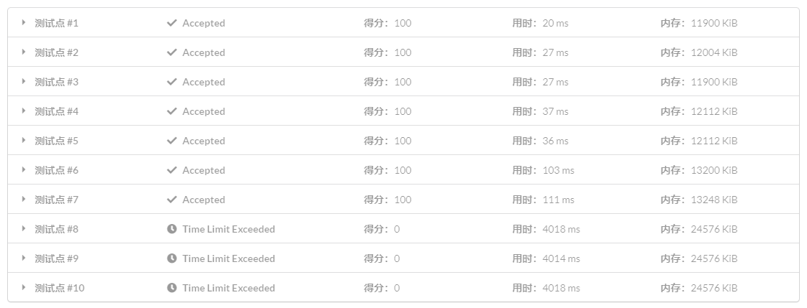

## 1. 前言

### 后缀数组和后缀树

> 在字符串处理当中，后缀树和后缀数组都是非常有力的工具。其实后缀数组是后缀树的一个非常精巧的替代品，它比后缀树容易编程实现，能够实现后缀树的很多功能而时间复杂度也不太逊色，并且，它比后缀树所占用的空间小很多。可以说，在信息学竞赛中后缀数组比后缀树要更为实用。——百度百科

### 各种定义

`子串`： 就是子串 [捂脸]

`后缀`： 就是从 $i$ 这个位置开始到该字符串的末尾的一个子串

`字符串大小`： $a$ 和 $b$ 这两个串，从头开始逐个字符按照 ASSIC 码进行比较

`后缀数组`： $sa[i]$ 代表该字符串的 $len$ 个后缀中，排名为 $i$ 的后缀是第 $sa[i]$ 个后缀

`名词数组`： $rank[i]$ 代表第 $i$ 个后缀排名为 $rank[i]$

## 2. 一些构造方法

### 最简单的暴力

把所有的后缀拆出来，然后 sort

思想较为简单，可自行尝试实现

```cpp
#include <bits/stdc++.h>
using namespace std;

int rank[123], sa[123];

struct Str {
	string s; int wei;
    friend bool operator < (Str a1,Str a2) {
    	return a1.s<a2.s;
    }
} k[123] ;

int main()
{
    string s;
    cin >> s;
    int len=s.size()-1;
    
    for (int i=0;i<=len;i++)
    {
    	k[i].wei=i;
        for (int j=i;j<=len;j++) 
            k[i].s=k[i].s+s[j];
    }
    
    sort (k,k+len+1);
    for (int i=0;i<=len;i++) {
      	rank[k[i].wei]=i;
        sa[i]=k[i].wei;
    }
    
    exit(0);
}
```

### 倍增

这个就是一般人写后缀数组用的方法

复杂度是 $O(nlogn)$ 

前提是你要先会 ** 基数排序 **

假设我们有这样一个字符串 `aabaaaab`

然后我们把所有的后缀列举出来：


然后用基数排序的方式，按照每个后缀的第一个字母进行排序，呈现这样子的效果：


接着我们以第二个字母为关键字，在首字母有序的基础上进行排序，这个时候，我们把首字母相同的后缀拿出来单看

对于每一组首字母相同的后缀，首字母是对排序没有影响的，所以可以直接按照第二个字母进行基数排序，同样，对于首字母不同的后缀，由于按照首字母排序时，他们的相对大小已经确定，当按照第二个字母排序时，不会出现 `原来 a>b，现在 b>a` 的现象，所以我们可以看成一直在做区域内的排序，这之后变成这样：



第三字母同理........

这样子我们可以处理这个问题，可是复杂度还是没有到达一个我们可以接受的范围

所以我们引入 ** 倍增 **

当我们按照每个后缀的前 $2^k$ 个字母进行完排序后，那么我们把后缀的前 $2^{k+1}$ 看做前后两个 $2^k$, 这样我们就可以把这前后两个 $2^k$ 作为之前说的 `首字母` 和 `第二个字母` 了，然后进行上述过程，就可以在 $O(nlogn)$ 的复杂度内处理这个问题了

```cpp
#include <bits/stdc++.h>
using namespace std;

int n;
int sa[150], x[150], c[150], y[150];
char a[150];

inline void SA () {
    int m=128;
    for (int i=0;i<=m;i++) c[i]=0;
    for (int i=1;i<=n;i++) c[x[i]]++;
    for (int i=1;i<=m;i++) c[i]+=c[i-1];
    for (int i=n;i;i--) sa[c[x[i]]--]=i;
    
    for (int k=1,p;k<=n;k<<=1)
    {
        p=0;
        for (int i=n;i>n-k;i--) y[++p]=i;
        for (int i=1;i<=n;i++) if(sa[i]>k) y[++p]=sa[i]-k;
        
        for (int i=0;i<=m;i++) c[i]=0;
        for (int i=1;i<=n;i++) c[x[i]]++;
        for (int i=1;i<=m;i++) c[i]+=c[i-1];
        for (int i=n;i;i--) sa[c[x[y[i]]]--]=y[i];
        
        p=y[sa[1]]=1;
        for (int i=2,a,b;i<=n;i++) {
            a=sa[i]+k>n ? -1 : x[sa[i]+k];
            b=sa[i-1]+k>n ? -1 : x[sa[i-1]+k];
            y[sa[i]]= (x[sa[i]]==x[sa[i-1]]) && (a==b) ? p : ++p ;
        }
        swap (x,y);
        m=p;
    }
}

int main () 
{
    scanf("%s",a+1);
    
    n=strlen (a+1);
    for (int i=1;i<=n;i++) x[i]=a[i];
    SA ();
    
    for (int i=1;i<=n;i++) 
        printf("%d",sa[i]);
    exit(0);
}
```

代码里 $x[i]$ 就是 $rank[i]$ 

$y[i]$ ：假设 $y[i]=a\\ ,\\  y[i+1]=b$ 那么在原串中 从 $a+2^k$ 开始的 $2^k$ 个字符组成的子串 ** 小于等于 ** 从 $b+2^k$ 开始的 $2^k$ 个字符组成的子串

最好理解这个代码时，每一步都结合这基数排序来考虑

**by 周运沛 **
