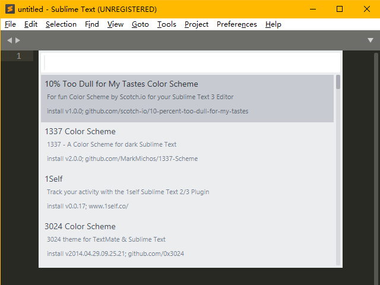
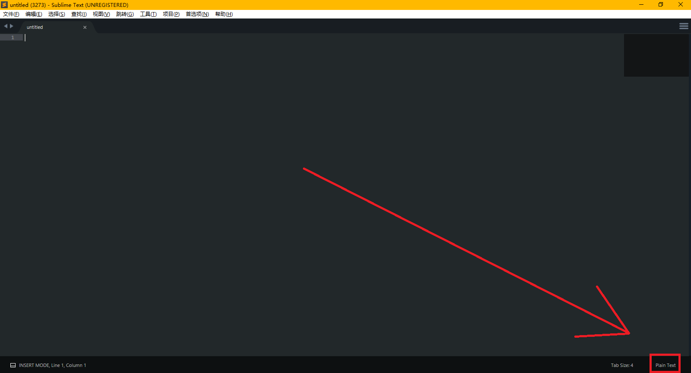

## 简介

Sublime Text 3 （以下简称 ST3 ）是一款轻量级的文本编辑器，支持多种语言的语法高亮及代码补全。具有高度的可拓展性以及 vim 模式。

ST3 相比于 ST2，性能大幅提升，安装插件也简单了许多。

## 安装

直接前往 [官网](https://www.sublimetext.com/3) 下载即可，如果使用搜索引擎，可能会搜索到中文官网，提供的安装包与英文官网是同一个链接。

ST3 的安装包并不会创建桌面快捷方式，需要自己手动创建。

???+note "Sublime 提示激活"

​    ST3 是收费软件，但有一个无限期的试用，试用并不会带来功能上的缺失，但会不时弹出弹窗提示你激活。

## 安装插件与自定义

### 汉化

ST3 并不支持中文，需要安装汉化插件。

#### 安装插件管理器

打开 ST3 后键入 `Crtl+Shift+P` 唤出命令框，输入`Install` 后回车（完整命令是 `Install Package Control` ，不区分大小写），此时应该会看到左下角有一个 `=` 在不停的左右移动。等待 Package Control 安装完成，具体的加载时间取决于网络。

如果完成的弹窗显示安装失败（与网络有关），则需要手动下载 [Package Control](https://packagecontrol.io/Package%20Control.sublime-package) 并将下载好的文件放到 `C:\Users\用户名\AppData\Roaming\Sublime Text 3\Installed Packages` 中。稍作等待，ST3 会自动识别该插件。

#### 安装汉化插件

再次按下 `Crtl+Shift+P` 输入 `Install` 后回车（完整命令是 `Package Contrl:Install Package` ），等待加载完成，接下来应该是这个界面：



输入`Chinese` 选择 ChineseLocalizationgs 并回车，等待安装完毕，完成后界面会自动切换为中文。

### 调整字体

从安装汉化插件后弹出来的提示文件中，可以看出 ST3 的默认字体对中文的支持很差。

进入 `首选项->设置` ，在右边的用户设置中的花括号中添加一行 `"font_face": "字体名",` ， ST3 的设置使用 json 储存，应该比较好理解。修改完成后保存，如果系统安装了对应字体会自动切换。

???+warning
​    注意不要在左边的的默认设置中修改，这是不被推荐的，如果软件更新，默认设置会被重置。

### 安装插件与主题

安装插件与主题的方法与安装汉化插件一致。

输入 `Crtl+Shift+P` 输入 `Install` 后回车，然后搜索插件/主题/配色即可。

由于ST3主要面向网页前端开发，所以一般来说编辑 C++的情况下并没有太多很好的插件，不过一般来说自带的功能已经足够了。

少量插件：

+ BracketHighlighter ：对原版的括号高亮进行了增强。

+ C++ Snippets ：ST3 自带有 C++ 代码补全，格式为大括号换行。如果不习惯大括号换行的码风可以安装这个插件，同时增加了少量补全。

+ C++ 11 ：支持 C++ 11 标准高亮。

+ SublimeAstyleFormatter ：Astyle，不解释。

+ C++ Completions ：提供与ST3自带补全不同的补全方式，但对 C++ 头文件的支持并不完全。

有其他需要可以自己尝试搜索。

一些主题：[^ref1]

3024 （单配色方案） 、 Grandson-of-Obsidian （单配色方案）、 Seti_UI （单主题）、 Material Theme 、 Predawn 、 Agila 、 Materialize 。

如果要编辑自己的配色方案，可以访问 [tmTheme Editor](http://tmtheme-editor.herokuapp.com/) 。

### 使用vim！

#### 开启方式

会用 vim 的同学估计在用其他编辑器（尤其是 Dev-C++ ）时会有这样的想法：要是这东西可以 <kbd>Esc</kbd> 再……就好了。

ST3 可以！

ST3 的 vim 模式是一个安装时自带的插件叫 Vintage ，它默认是禁用的。可以通过 `首选项->设置` 在用户设置中，将 `"ignored_packages"` 一项中的 Vintage 删除并保存， ST3 的状态栏左边就会出现 `INSERT MODE` ，这时就可以愉快的打 vim 了。

#### 与真正 vim 的不同

ST3 的 vim 模式与真正的 vim 略有区别，以下为找到的部分（欢迎补充）：

+ 在插入模式下用选中不会进入可视模式，这时输入不会被识别为命令而是直接替换文本。可视模式只有命令模式下才能进入。
+ `r` 、 `R` 、 `zA` 、 `za` 、 `zi` 、 `z=` 、 `@` 与使用 <kbd>[</kbd>  、 <kbd>]</kbd> 或 <kbd>"</kbd> 键的命令不存在。
+ 使用 <kbd>Ctrl</kbd> 、 <kbd>Shift</kbd> 和 <kbd>Alt</kbd> 键的快捷键会保留为 ST3 设置的快捷键，如 `Ctrl+V` 不会进入可视模式而是正常粘贴。
+ 命令行模式只保留了 `:e` 、 `:0` 、 `:$` 、 `:s`  。
+ 使用 `\` 与 `?` 命令会自动唤出搜索框，而不是直接在命令中键入单词进行搜索。同时，数字将无法生效。
+ `q` 宏录制命令会启动 ST3 自带的宏录制，按 <kbd>q</kbd> 后需要再按一个键启动录制，但录制的宏不会与该键绑定，需要按 `Crtl+Shift+Q` 才能启动。如果需要保存，需要 `工具->保存宏` ，快捷键需要设置。
+ 该插件的实现方式是通过修改快捷键，由于已经打包，无法进行设置。

??? note "让 ST3 更加 vim " 
  ​    从快捷键设置可以看出 ST3 的模式与 vim 很像，理论上可以大部分配置成 vim ，但显然需要相当的耐心。

### 设置快捷键

在`首选项->快捷键设置` 中设置，在左边找到自己需要修改的功能，然后复制到右边并修改按键即可。注意 ST3 的功能极多，不要与其他功能重复了，或者把重复的功能的快捷键也改掉。

## 编辑

### 设置语法

按右下角的 `Plain Text` 然后修改为你需要的语言即可。



### 快捷键

注意 ST3 有复合快捷键，如 `Ctrl+K` & `Ctrl+Backspace` 表示先按 `Ctrl+K` 再按 `Ctrl+Backspace` ，不要认为是两者都可以。

以及不要尝试用 vim 模式中的 `j` 、 `k` 命令代替上下来触发快捷键。

部分快捷键：[^ref2]

| 按键                        | 命令                                                         |
| --------------------------- | ------------------------------------------------------------ |
| `Ctrl+X`                    | 剪切当前行                                                   |
| `Ctrl+Shift+k`              | 删除行                                                       |
| `Ctrl+Enter`                | 在下方插入行                                                 |
| `Ctrl+Shitf+Enter`          | 在上方插入行                                                 |
| `Ctrl+Shitf+Up`             | 行上移                                                       |
| `Ctrl+Shitf+Down`           | 行下移                                                       |
| `Ctrl+L`                    | 选择行，重复以向下选择多行                                   |
| `Ctrl+D`                    | 选择词，重复以选择多个相同词，并进入多点编辑（用于快速批量更改） |
| `Ctrl+M`                    | 跳转到匹配的括号                                             |
| `Ctrl+Shift+M`              | 选择括号内的内容，重复以包括括号                             |
| `Ctrl+K` & ` Ctrl+K`        | 删至行尾（复合快捷键，建议使用 vim 模式代替）                |
| `Ctrl+K` & `Ctrl+Backspace` | 删至行首（复合快捷键，建议使用 vim 模式代替）                |
| `Ctrl+]`                    | 缩进当前（选择的）行                                         |
| `Ctrl+[`                    | 取消缩进当前（选择的）行                                     |
| `Ctrl+Shift+D`              | 复制当前行，并插入在下一行                                   |
| `Ctrl+J`                    | 合并下一行与当前行                                           |
| `Ctrl+Shift+V`              | 粘贴并缩进（用于整段粘贴代码）                               |
| `Ctrl+K` & `Ctrl+Shift+V`   | 从历史粘贴（复合快捷键，建议修改为 `Ctrl+Alt+V `）           |
| `Ctrl ␣`                    | 选择下一个自动补全建议（与 <kbd>Down</kbd> 等价，注意是空格） |
| `Crtl+Alt+Down`             | 光标下移，并保留当前行光标（进入多点编辑模式）               |
| `Crtl+Alt+Up`               | 光标上移，并保留当前行光标（进入多点编辑模式）               |
| ~                           | 转换选择内容的大小写                                         |

### 自动补全

ST3 有丰富的补全功能，可能的补全内容会在光标下方显示，按 <kbd>Tab</kbd> 进行补全。

补全后一般会选择一块区域进行编辑，编辑完成后再次按 <kbd>Tab</kbd> 进行正常代码的编辑（ for 循环等复杂代码可能有多个编辑块，需要按多次 <kbd>Tab</kbd> ）。

自动补全的风格无法调整，除非使用插件。

如果没有自动补全，请如下修复：

1. 检查是否切换了语言， ST3 默认新建文件为 Plain Text。

2. 进入 `首选项->设置` 然后添上两行：

   ```json
   "auto_complete": true,
   "auto_match_enabled": true,
   ```

   

## 编译与运行

ST3 的编译环境已经配置好了，可以直接使用。

Windows 环境下需要将 g++ 所在目录添加到环境变量中，并将其优先级调至最高。

### 编译

直接按 `Ctrl+B` 编译，第一次使用会让你选择编译方式，选择 `C++ Single File ` 或 `C++ Single File - Run` 。

#### 修改编译选项

虽然 ST3 自带编译环境，但不幸的是，编译选项无法修改。

如果需要修改编译选项，则需要自己新建一个编译系统。

进入 `系统->编译系统->新建编译系统…` 然后在大括号中间输入：

```json
 	"cmd": ["cmd","/c","g++","-Wall","-lm","${file}","-o","${file_path}/${file_base_name}","&&","cmd","/c","${file_path}/${file_base_name}"],    //编译选项可以自己调整
	"file_regex": "^(..[^:]*):([0-9]+):?([0-9]+)?:? (.*)$",    //这一行可以让ST3图形化显示报错，如果习惯了看g++返回的信息可以去掉
```

保存后把编译系统切换到你自己写的这个，就可以使用了，这里的配置是在ST3窗口内编译并运行。

保存的文件为 `C:\Users\用户名\AppData\Roaming\Sublime Text 3\Packages\User\编译系统名.sublime-build` 可以反复修改。

??? note "其他配置方法"
    以下为满足各位的各种需要而写，可能需要掌握一些命令行的知识。

    只编译 
    
    ```json
        "cmd": [“g++","-Wall","-lm","${file}","-o","${file_path}/${file_base_name}"],
    ```
    
    在外部 CMD 运行
    
    ```json

 	    "cmd": ["cmd","/c","g++","-Wall","-lm","${file}","-o","${file_path}/${file_base_name}","&&","start","cmd","/c","${file_path}/${file_base_name}&pause"],
    ```
    

    ```
    
    还可以利用一些方法把编译和运行拆开并分别配置快捷键，由于并不必要，请自行搜索。

### 运行

如果编译时选择 `C++ Single File - Run` （或者自己配置了自动运行） ，那么在下方弹出的编译信息窗口可能不会有任何显示，因为 ST3 的编译信息窗口兼职 CMD ，此时它在等你给正在运行的程序输入数据。

运行结束后会提示程序的运行时间。

??? note "为什么感觉时间多了？"
    注意这个时间包括编译的时间。

???+warning
​    这个窗口无法输入 `F6` 或 `Crtl+Z` ，如果运行读入到文件末尾的程序请使用文件输入，或使用上面「其他配置方法」中写的方法在外部 CMD 运行。

### 调试

可以安装插件使 ST3 支持 gdb 调试，但不建议依赖插件进行 gdb 调试。

更好的做法是在配置编译系统时加上相关命令启动 gdb ，在外部进行命令行调试。

## 杂项

+ 把文件夹拖进 ST3 中并开启侧边栏，从而快速切换文件。

+ 善用跳转功能，尤其是 `Ctrl+P` 进行文件跳转与 `Ctrl+R` 进行函数跳转。

+ ST3 支持git。

## 外部链接

+ [使用命令行调试](/tools/cmd)


## 参考资料与注释

[^ref1]: [便捷清新的文本编辑器 sublime](https://www.luogu.com.cn/blog/acking/sublime)

[^ref2]: [Sublime Text社区文档](https://docs.sublimetext.io/)
