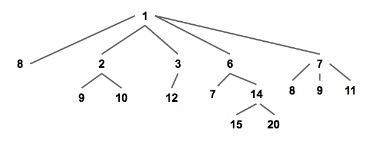
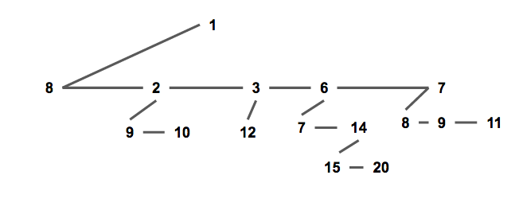
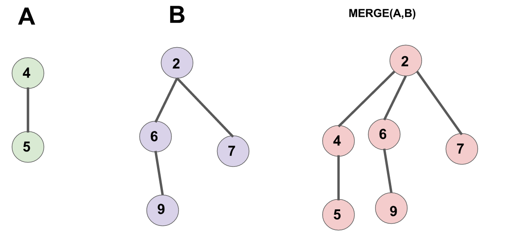
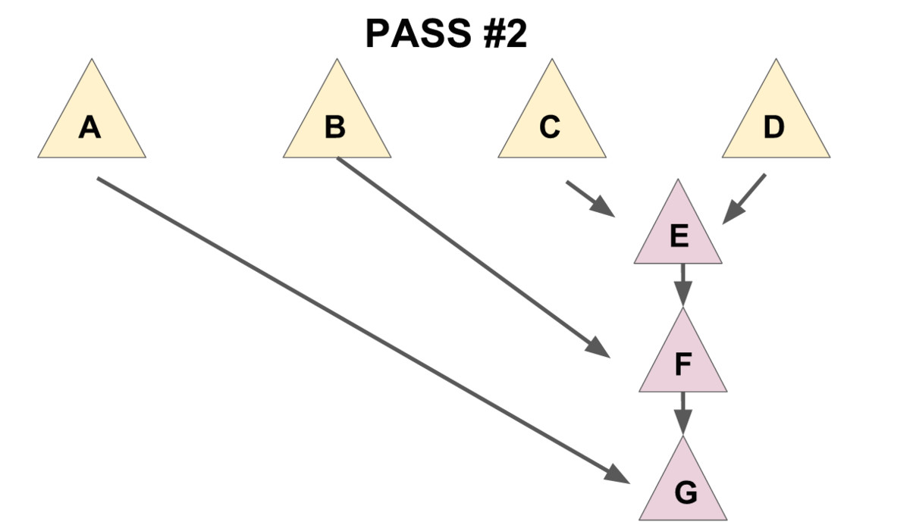

Title: 配对堆
Tag: data-structure
Tag: heap

### 简介

配对堆是一个支持插入，查询/删除最小值，合并，修改元素等操作的数据结构，也就是俗称的可并堆。  
配对堆在 OI 界十分的冷门，但其实跑得比较快，也很好写，但不能可持久化，因为配对堆复杂度是势能分析出来的均摊复杂度。

### 定义

这里给出一个较为简单的定义，严谨的定义可以查阅参考文献[4]。  
配对堆是一棵带权多叉树（如下图），其权值满足堆性质（即每个节点的权值都小于他的所有儿子）。  


通常我们使用左儿子右兄弟表示法储存一个配对堆（如下图），从下文可以看出这种方式可以方便配对堆的实现。



### 各项操作的实现

#### 存储结构定义

就是普通的带权多叉树的表示方式。

```cpp
struct Node {
  T v;            // T为权值类型
  Node *ch, *xd;  // ch为该节点儿子的指针，xd为该节点兄弟的指针。
                  //若该节点没有儿子/兄弟则指针指向虚拟空节点。
};
```

#### 查询最小值

从配对堆的定义可看出，配对堆的根节点的权值一定最小，所以我们直接返回根节点就行了。

#### 合并

配对堆的合并操作极为简单，直接把根节点权值较大的那个配对堆设成另一个的儿子就好了。（如下图）  
  
复杂度的话，操作本身显然是 $O(1)$ 的，考虑到对势能的影响后还是均摊 $O(1)$ 

```cpp
Node* merge(Node* a, Node* b) {
  // 若有一个为空则直接返回另一个
  if (a == node) return b;
  if (b == node) return a;
  if (a->v > b->v) swap(a, b);  // swap后a为权值小的堆，b为权值大的堆
  //将b设为a的儿子
  b->xd = a->ch;
  a->ch = b;
  return a;
}
```

#### 插入

合并都有了，插入就直接把新元素视为一个新的配对堆和原堆合并就行啦。

#### 删除最小值

到这里我们会发现，前面的几个操作都十分偷懒，几乎完全没有对数据结构进行维护，所以删除最小值是配对堆最重要的（也是最复杂）的一个操作。  
考虑我们拿掉根节点之后会发生什么，根节点原来的所有儿子构成了一片森林，所以我们要把他们合并起来。  
一个很自然的想法是使用 `merge` 函数把儿子们一个一个并在一起，这样做的话正确性是显然的，但是会导致复杂度退化到 $O(n)$ 。为了保证删除操作的均摊复杂度为 $O(\log n)$ ，我们需要：把儿子们两两配成一对，先用 `merge` 操作把被配成同一对的两个儿子合并到一起（见下图 1)，再按上述方法将新产生的堆暴力合并在一起（见下图 2）。

先实现一个辅助函数 `merges` ，作用是合并一个节点的所有兄弟。

##### 递归版本的 merges（推荐）

实现上，推荐使用这种好写的递归式实现。

```cpp
Node* merges(Node* x) {
  if (x == node || x->xd == node)
    return x;  //如果该树为空或他没有兄弟（即他的父亲的儿子数小于2），就直接return。
  Node *a = x->xd, *b = a->xd;  // a：x的一个兄弟，b：x的另一个兄弟
  x->xd = a->xd = node;         //拆散
  return merge(merge(x, a), merges(b));  //核心部分
}
```

最后一句话是该函数的核心，这句话分三部分：

1.   `merge(x,a)` “配对”了 x 和 a。
2.   `merges(b)` 递归合并 b 和他的兄弟们。
3.  将上面 2 个操作产生的 2 个新树合并。

##### 迭代版本的 merges

迭代版本不仅不好写，而且实现不优越的话还不一定比递归版快（下面这个就是不优越的实现，跑的不比上面的递归版本快），所以更推荐写递归版。

```cpp
Node* merges(Node* x) {
  Node* t = x;
  x = x->xd;
  t->xd = node;
  while (x->xd != node) {
    Node *a = x->xd, *b = a->xd;
    x->xd = a->xd = node;
    t = merge(t, merge(x, a));
    x = b;
  }
  return merge(t, x);
}
```

然后 `delete-min` 操作就显然了。（因为这个封装实在没啥用，实际在实现时中一般不显式写出这个函数）

```cpp
Node* delete_min(Node* x) { return merges(x->ch); }
```

#### 减小一个元素的值

要实现这个操作，需要给节点添加一个 father 指针，会使实现变得相对复杂。  
首先节点的定义修改为：

```cpp
struct Node {
  T v;
  Node *ch, *xd;
  Node *fa;  //新增：fa指针，指向该节点的父亲，若该节点为根节点则指向虚拟空节点
};
```

 `merge` 操作修改为：

```cpp
Node* merge(Node* a, Node* b) {
  if (a == node) return b;
  if (b == node) return a;
  if (a->v > b->v) swap(a, b);
  a->fa = node;
  b->fa = node;  //新增：维护fa指针
  b->xd = a->ch;
  a->ch->fa = b;  //新增：维护fa指针
  a->ch = b;
  return a;
}
```

 `merges` 操作修改为：

```cpp
Node* merges(Node* x) {
  x->fa = node;  //新增：维护fa指针
  if (x == node || x->xd == node) return x;
  Node *a = x->xd, *b = a->xd;
  x->xd = a->xd = node;
  a->fa = node;  //新增：维护fa指针
  return merge(merge(x, a), merges(b));
}
```

现在我们来考虑如何实现 `decrease-key` 操作。  
首先我们发现，当我们对节点 x 进行 `decrease-key` 操作后，以 $x$ 为根的子树仍然满足配对堆性质，但 $x$ 的父亲和 $x$ 之间可能不再满足堆性质。  
因此我们可以把整棵以 $x$ 为根的子树剖出来，这样现在两棵树都符合配对堆性质了，再把他们 `merge` 起来就做完了。  
这个操作本身复杂度显然为 $O(1)$ ，但会破坏原有的势能分析过程，因此均摊复杂度难以证明（目前学术界还无法给出复杂度的精确值），通常可以简单的认为复杂度为 $o(\log n)$ （注意这里为小 o）。

```cpp
// root为堆的根，x为要操作的节点，v为新的权值，调用时需保证x->v<=v
//返回值为新的根节点
Node* decrease - key(Node* root, Node* x, LL v) {
  x->v = v;                     //修改权值
  if (x->fa == node) return x;  //如果x为根，就不用接下去的步骤了。
  //把x从fa的子节点中剖出去，这里要分x的位置讨论一下。
  if (x->fa->ch == x)
    x->fa->ch = x->xd;
  else
    x->fa->xd = x->xd;
  x->xd->fa = x->fa;
  x->xd = node;
  x->fa = node;
  return merge(root, x);  //合并root和x。
}
```

### 复杂度分析

见 [配对堆的论文](http://www.cs.cmu.edu/~sleator/papers/pairing-heaps.pdf) 。

### 参考文献

1.   [HOOCCOOH 的题解](https://hooccooh.blog.luogu.org/solution-p3377) 
2.  集训队论文《黄源河 -- 左偏树的特点及其应用》
3.   [《配对堆中文版》](https://wenku.baidu.com/view/f2527bc2bb4cf7ec4afed06d.html) 
4.   [维基百科 pairing heap 词条](https://en.wikipedia.org/wiki/Pairing_heap) 
5.   <https://blog.csdn.net/luofeixiongsix/article/details/50640668> 
6.   <https://brilliant.org/wiki/pairing-heap/> （注：本条目所有图片均来自这里）
